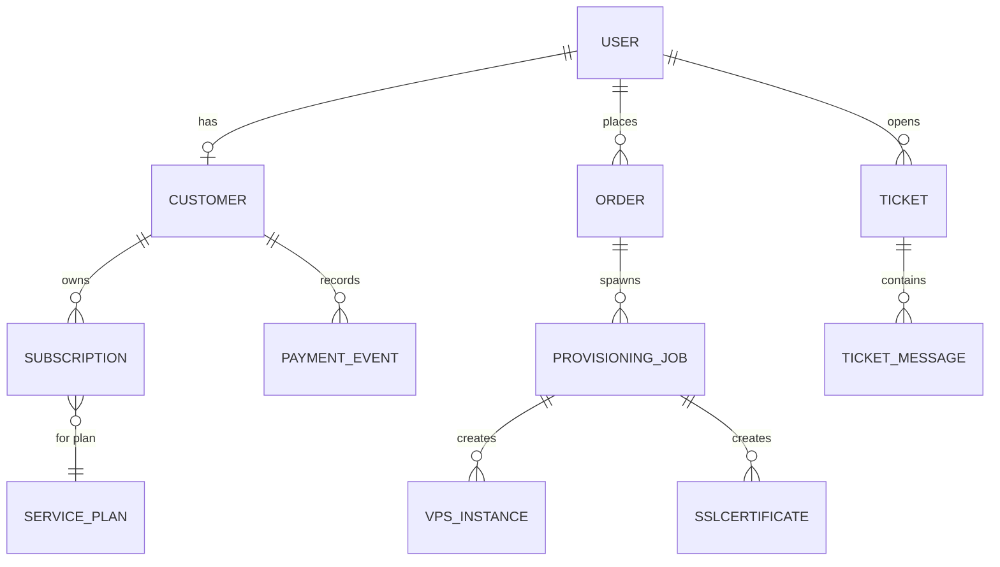
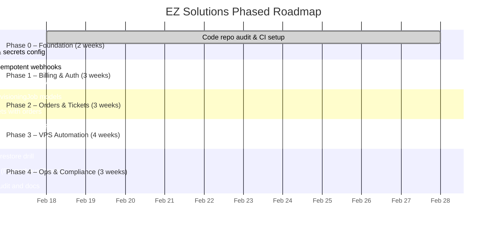

# Production-Grade Django SaaS (EZ Solutions) – Standards, Security & Roadmap

**Executive Summary:** *EZ Solutions* is being built as a Django-based SaaS offering hosting (VPS, domains, SSL) and related IT services. The current GitHub repo (`iamez/ez-solutions`) has a sound scaffold (apps for `home`, `users`, `services`, `orders`, `tickets`, `api`, plus `domains` placeholder) with Bootstrap UIs and a Stripe checkout/ticketing integration. The main gaps are production hardening and service fulfillment (e.g. automating VPS/domain provisioning).  Industry best practices dictate using a **12‑factor app layout** (Cookiecutter-Django style), strict settings separation (dev vs prod), and environment-based config. Authentication should use Django’s proven framework (django-allauth for email/MFA), with session-based security and CSRF protection. Payments should flow through Stripe Checkout and Customer Portal, handling webhooks **asynchronously and idempotently** (Stripe’s docs note events can be retried or out of order). The data model will include Users, Customers (Stripe), Subscriptions, Orders, PaymentEvents, Tickets, and future ProvisioningJobs/Resources. Security must follow OWASP/Django checklists: HTTPS everywhere, secure cookies, HSTS/CSP headers, input validation, secrets management, and rate limiting. Testing should be rigorous (pytest for units/integration, webhook scenarios) and enforced by CI (with black, ruff, bandit, pip-audit). Deployment targets are Postgres, Gunicorn/ASGI, Nginx (or Caddy) with Docker or Kubernetes; backups, monitoring (Prometheus, Sentry), and Proxmox API automation are required. Operationally, we’ll handle webhook replays (store event IDs), use migrations with zero-downtime strategy, and support feature flags/canary deploys. Compliance includes GDPR (Article 32 security requirements) and minimizing PCI scope (Stripe Checkout qualifies for PCI SAQ A). Below is a detailed report, including a Repo Map, comparison tables, mermaid diagrams, prioritized checklists (Phases 0–4), and updated docs. The report concludes with a **copyable “super prompt”** for an AI agent, encapsulating all these requirements.

## Current Repo-State and Repo Map

**Enabled connector:** GitHub (repo `iamez/ez-solutions`).

- **Structure:** The repo has `manage.py`, `config/settings/base.py` (env-based config), `dev.py`, `prod.py` (unspecified), and directories: `home/`, `users/`, `services/`, `orders/`, `tickets/`, `api/`, plus a stub `domains/`.  
- **Apps & Endpoints:**  
  - **home:** Landing page (`/`, `/about/`, `robots.txt`).  
  - **users:** Custom `User` model (email login), profile/dashboard views (namespace `/dashboard/`).  
  - **services:** `ServicePlan` & `PlanFeature` models; pricing list and detail (`/pricing/`).  
  - **orders:** Models: `Customer` (FK to User, stripe_customer_id), `Subscription` (stripe_subscription_id, status), `PaymentEvent` (stripe_event_id, payload). Views for Checkout session (`/billing/checkout/<plan>/`), Customer Portal (`/billing/portal/`), and a webhook (`/webhooks/stripe/`).  
  - **tickets:** `Ticket` and `TicketMessage` models for support threads, under `/tickets/`.  
  - **api:** DRF views/serializers (health check, `/api/v1/me/`, plans, tickets).  
  - **domains:** Placeholder; no models/views yet.  
- **Templates:** Shared Bootstrap base, including django-allauth templates in `templates/account/`.  
- **Settings:** `base.py` uses `Config()` to read env vars (`SECRET_KEY`, DB, Stripe keys, etc.). `dev.py` and `prod.py` exist but contents aren’t loaded by us.  
- **Missing Pieces:** Domain/SSL ordering models; provisioning tasks for VPS (e.g. `ProvisioningJob`, `VPSInstance`); email/email template wiring (Mailgun is in requirements); comprehensive tests and CI configuration (only initial pipeline is in place).

**Concise Repo Map:** 

| Component        | Status/Contents                                                                |
|------------------|-------------------------------------------------------------------------------|
| **User/Auth**    | Custom `User` (email-based), django-allauth for accounts (login/signup).       |
| **ServicePlans** | `ServicePlan` with stripe price IDs (monthly/annual), `PlanFeature`.          |
| **Billing**      | Stripe checkout & portal integration. `Customer`, `Subscription`, `PaymentEvent` models.  |
| **Support**      | `Ticket`, `TicketMessage` models; ticket submission flow.                     |
| **API**          | Minimal DRF endpoints for user info, plans, tickets.                          |
| **Misc.**        | `domains` app is empty (to be implemented). Bootstrap templates and static files. |
| **Env Config**   | `.env.example` exists (with placeholders, Stripe keys). Real secrets not in repo. |
| **CI/CD**        | Github Actions with black/ruff/pytest; needs more coverage.                    |

If any file content was hidden (prod settings, env file), we note it as **unspecified**. This repo has the **blueprint** and UI done, but needs the “engine” built: real business logic, security hardening, and integration work.

## Architecture Patterns & Data Model

- **Project layout:** Use Django’s recommended multi-settings structure (base/dev/prod) and 12‑factor style (environment variables for config). Cookiecutter-Django is a proven template for this.  
- **Stack:** Monolithic Django (with Celery workers) connecting to PostgreSQL; Redis for caching/Celery; Nginx/Traefik/Caddy proxy; Docker or optional Kubernetes for containerization.  
- **Data Model:** High-level models should include:  
  - *User* (from `users` app).  
  - *Customer* (FK to User; holds `stripe_customer_id`).  
  - *Subscription* (FK Customer; `stripe_subscription_id`, plan, status, dates).  
  - *ServicePlan/PlanFeature* (catalog of products).  
  - *Order* (new model representing a customer request: e.g. “Create VPS”).  
  - *ProvisioningJob* (tracks async tasks: provisioning a VM, issuing SSL, etc.).  
  - *VPSInstance/DomainRegistration/SSLCertificate* (future resource models with details).  
  - *PaymentEvent* (already present; logs stripe webhooks).  
  - *Ticket/Message* (support threads).



This aligns with best practice: separate **billing entities** (Customer, Subscription) from **service entities** (VPSInstance, DomainRegistration, etc.). Stripe’s own guides suggest you treat webhook events as truth and then update your database accordingly. 

## Authentication & Authorization

- **Django allauth (session) vs alternatives:** The repo uses django-allauth (found in `INSTALLED_APPS`), which is suitable. It provides email verification, password reset, and social auth. We should continue using it rather than reinventing auth. For now, use standard Django session auth (with CSRF protection). JWTs are only needed if a public API is added later.  
- **Account security:** Enforce email confirmation and strong password policies (`AUTH_PASSWORD_VALIDATORS`). Encourage MFA for staff (allauth supports TOTP).  
- **Admin:** Secure `/admin/`: require HTTPS, use a non-default URL if desired, and limit staff permissions. Django’s `X-Frame-Options: DENY` is default, preventing admin clickjacking. Use `django-axes` or similar if needed for login lockouts.  

## Billing & Stripe Integration

- **Stripe Checkout:** Already in place (`orders.views.checkout_session`). This offloads PCI scope to Stripe. Ensure plans are created in Stripe (stripe_price_id in ServicePlan).  
- **Customer Portal:** `/billing/portal/` is configured to redirect to Stripe’s hosted portal (good for self-service subscription management).  
- **Webhooks:** Use Stripe webhooks to **finalize** orders. Django view `/webhooks/stripe/` must use `stripe.Webhook.construct_event` on `request.body`, verify the signature, and then handle events. Stripe warns events may arrive multiple times or out-of-order, so our handler must be idempotent. That means: *first insert PaymentEvent by `event.id` inside a transaction, and if it already exists, skip processing.* Enqueue actual handling asynchronously (e.g. Celery task).  
- **Idempotency:** For outbound API calls (creating customers/subscriptions via Stripe SDK), use unique idempotency keys to prevent duplicates on retry.

**Example webhook handler snippet:**

```python
@csrf_exempt
def stripe_webhook(request):
    event = stripe.Webhook.construct_event(request.body, request.META['HTTP_STRIPE_SIGNATURE'], settings.STRIPE_WEBHOOK_SECRET)
    with transaction.atomic():
        obj, created = PaymentEvent.objects.get_or_create(
            stripe_event_id=event['id'],
            defaults={'payload': event, 'event_type': event['type']}
        )
        if not created:
            return HttpResponse(status=200)  # Duplicate event
        # (If created) Enqueue background task to process obj.id
    return HttpResponse(status=200)
```

This follows Stripe’s best practice for signature verification and idempotency.

- **Subscription mapping:** On `invoice.payment_succeeded` or `customer.subscription.updated` events, update the `Subscription` model (`status`, `current_period_end`, etc.) and the User’s entitlement level. Map Stripe plan IDs to local `ServicePlan` via `stripe_price_id`.

## Security Hardening

- **Django Deployment Checklist:** Run `python manage.py check --deploy` to catch missing settings (DEBUG, ALLOWED_HOSTS, etc.). Key settings: `DEBUG=False`, proper `ALLOWED_HOSTS`, `SECURE_SSL_REDIRECT=True`, `SECURE_HSTS_SECONDS` (with includeSubDomains after testing).  
- **HTTPS:** Enforce HTTPS everywhere. Use a reverse proxy with TLS (Let’s Encrypt certs). Enable HSTS per OWASP [HSTS guidelines](https://cheatsheetseries.owasp.org/cheatsheets/HTTP_Strict_Transport_Security_Cheat_Sheet.html).  
- **Cookies & Session:** Set `SESSION_COOKIE_SECURE = True`, `CSRF_COOKIE_SECURE = True`, and `SESSION_COOKIE_SAMESITE='Lax'` (recommended by OWASP Session management). Django’s default `HttpOnly` is fine.  
- **CSRF & XSS:** Keep `CsrfViewMiddleware` enabled; use `` in forms. For XSS, rely on Django’s auto-escaping. Consider adding a Content Security Policy (CSP) header (`default-src 'self'; script-src 'self'; ...`) for added protection.  
- **Input validation:** Use Django form/model validators to sanitize inputs. Do not run unsanitized shell commands or `eval`.  
- **Secrets:** Do not commit secrets. Use a secret manager or secure storage for env vars (especially for Stripe keys, DB passwords, and `PROXMOX_TOKEN_SECRET`).  
- **Rate limiting:** Implement throttling on login/signup and on sensitive endpoints (Django REST Framework throttle classes or middleware) to mitigate brute force.  
- **Password Policies:** Enable Django’s validators (`MinimumLengthValidator`, `CommonPasswordValidator`, etc.) and consider Argon2 hashing (Django supports it). Enforce password reset security (revoke active sessions on reset).  
- **MFA:** Require two-factor for admin/staff logins (allauth supports it). Even if not requiring all users to have MFA initially, strongly encourage it for privileged accounts.  
- **Audit Logging:** Log security-relevant events (login failures, password changes, permission denials). Protect log integrity. OWASP Logging Cheat Sheet recommends detailed auth logs.  
- **Penetration Testing:** In later stages, conduct a security audit or penetration test for final certification.

## Testing & Quality Gates

- **Unit Tests:** Use pytest-django. Cover models (e.g., plan limits), views, and utilities. Critical flows: signup/login, ticket CRUD, plan pages.  
- **Integration Tests:** Write tests for full interactions: user places order, Stripe webhook completes, user account is upgraded. Use Django’s test client or HTTP tests.  
- **Webhook Tests:** Simulate Stripe webhook POSTs. Test signature verification fails on bad sig; test event replay handling. Stripe provides example payloads (use [`stripe-cli` replay feature] optionally).  
- **CI Pipeline:** The GitHub Actions should run black formatting, ruff linting, pytest tests, bandit static analysis, and `pip-audit`. Any PR must fix lint errors before merging.  
- **Pre-commit:** Use pre-commit hooks for black and ruff to catch style issues early.  
- **Quality Metrics:** Aim for high test coverage on core logic; treat failed tests or lint as blockers.  
- **Documentation:** Maintain developer docs for setup and architecture. Update `/docs/` (PLAN, SECURITY_CHECKLIST, etc.) at each phase completion.

## Deployment & Infrastructure

- **Database:** PostgreSQL is recommended for its reliability and features. (Django’s docs emphasize Postgres as a production DB).  
- **App Server:** Use Gunicorn (WSGI) or Uvicorn (ASGI for websockets) with workers. Ensure `CONN_MAX_AGE` is set for DB pooling.  
- **Reverse Proxy:** Nginx/Traefik/Caddy for TLS, static files, and request routing. Caddy has automatic HTTPS out-of-box, which can simplify setup.  
- **Docker:** Containerize the app for consistency. Use Docker Compose for dev, Kubernetes for prod if scaling is needed (not mandatory for MVP).  
- **Static/media files:** Serve via CDN or cloud storage (AWS S3) with Django-Storages. Environment variables for AWS keys as needed.  
- **Redis & Celery:** Use Redis for cache/session and as Celery broker. Run separate Celery workers for async tasks (Stripe event handling, provisioning jobs, email sending).  
- **Proxmox Integration:**  
  - Use Proxmox VE API with tokens (`pveum` CLI can create tokens with limited privileges). Store `PROXMOX_TOKEN_ID`/`PROXMOX_TOKEN_SECRET` in env.  
  - Create a VM template with cloud-init support. Provisioning task should clone this template, set config, and start the VM.  
  - Protect Proxmox: enable its firewall (see Proxmox docs) so only trusted IPs can access the UI/API.  
- **Backups:** Automate DB backups (PgDump) and file backups. For VMs, use Proxmox Backup or snapshots.  
- **Monitoring:**  
  - Use Sentry for errors (official Python SDK).  
  - Instrument metrics with Prometheus (django-prometheus) and use Grafana for dashboards. Follow Grafana’s alerting best practices (alert on 5xx or high latency).  
  - Log format should include timestamps, user IDs, request paths.  
- **Infrastructure services:** Likely none needed beyond Stripe and Mailgun. You can use managed DB (RDS) and monitoring services if preferred.

## Operations & Incident Response

- **Webhooks:** Maintain a way to manually replay Stripe events (via Stripe Dashboard or CLI) if something is missed. Since full event payloads are only available up to 30 days, handle errors promptly.  
- **Idempotency:** We already covered storing `event.id` to make webhooks idempotent. Also use Stripe API idempotency keys on create calls.  
- **Migrations:** Use Django migrations; deploy them before new release. Avoid dangerous migrations (e.g. dropping columns without fallback).  
- **Feature flags:** Use a library (e.g. django-waffle) to gradually roll out new features to subsets of users. This prevents all-at-once risk.  
- **Rolling Deploys:** If on Kubernetes, use rolling updates. If on a single VM, deploy one instance at a time and test.  
- **Canary Releases:** For critical changes, route a fraction of traffic to a new version to test before full rollout.  
- **Incident Response:** Have runbooks for major failures. GDPR requires breach notification in 72h. Log retention should be sufficient to trace issues (retain logs for months).

## Compliance & Privacy

- **GDPR:** Ensure data is encrypted at rest (DB encryption) and in transit (HTTPS). Inform users about data usage (Privacy Policy). Implement user data deletion/anonymization upon request.  
- **PCI:** By using Stripe Checkout, you largely delegate PCI compliance to Stripe (you will likely need SAQ A, since you do not handle card data). The [PCI FAQs](https://pcisecuritystandards.org/faq/merchants/when-do-i-need-to-report-compliance-to-the-pci-security-standards-council-ssc) note that merchants using fully outsourced payment forms can do SAQ A. Still, follow Stripe’s security guidelines (e.g. use HTTPS for all checkout URLs, validate SSL certs).  
- **Retention:** Only store transaction IDs and necessary customer info. Let Stripe retain billing records per regulation. Purge logs/data according to your data retention policy.

## MVP Scope & Phased Roadmap

We recommend a phased approach:



**Phase 0 Checklist (minimum):**  
- [ ] Linting/formatting (black, ruff) is passing.  
- [ ] Migrations apply cleanly; dev server runs.  
- [ ] `DEBUG=False` works without errors; `ALLOWED_HOSTS` set.  
- [ ] Env vars loaded (e.g. `DJANGO_SECRET_KEY`, `DATABASE_URL`, `STRIPE_*`).  
- [ ] Run `python manage.py check --deploy` with production settings; fix any fatal issues.  
- [ ] Test Stripe flow in test mode (create a Checkout session via shell using `DJANGO_DEBUG` and dummy keys).  
- [ ] Basic user signup/login and admin creation succeed.  

Meeting this certifies a secure baseline before adding features.

## Environment Variables & Third-party Services

**Env vars (to define in config/prod):** 
```
DJANGO_SECRET_KEY, DEBUG, ALLOWED_HOSTS,
DATABASE_URL,
REDIS_URL, CELERY_BROKER_URL,
STRIPE_SECRET_KEY, STRIPE_PUBLISHABLE_KEY, STRIPE_WEBHOOK_SECRET,
EMAIL_HOST, EMAIL_PORT, EMAIL_HOST_USER, EMAIL_HOST_PASSWORD,
DEFAULT_FROM_EMAIL,
SENTRY_DSN,
PROXMOX_API_URL, PROXMOX_TOKEN_ID, PROXMOX_TOKEN_SECRET,
AWS_ACCESS_KEY_ID, AWS_SECRET_ACCESS_KEY, AWS_STORAGE_BUCKET_NAME,
SITE_URL (e.g. https://ez-solutions.example.com)
```

**Third-party services:**
- **Stripe** (Checkout, subscriptions).  
- **Email provider** (e.g. Mailgun, already in requirements).  
- **Proxmox VE** (self-hosted; use REST API).  
- **Observability:** Sentry (error tracking), Prometheus/Grafana (metrics).  
- **DNS/SSL:** Let’s Encrypt (for domains), possibly Cloudflare (if used).  
- **Payment:** None else (Stripe covers).  

## Table: Comparative Options

| Category          | Options              | Pros                                      | Cons                                   |
|-------------------|----------------------|-------------------------------------------|----------------------------------------|
| **Auth**          | Django allauth (session) | Built-in email flows/MFA support; CSRF-secure | Web-only (no external API tokens)       |
|                   | DRF JWT (simplejwt)  | Stateless for APIs; mobile-friendly        | More complexity (token storage, revocation) |
| **Database**      | PostgreSQL           | Strong feature set, stability             | Requires separate DB server            |
|                   | MySQL/MariaDB        | Popular, easy scaling (sharding)          | Lacks some Postgres features           |
| **Deployment**    | Gunicorn + Nginx     | Well-known, battle-tested                 | Need config management for SSL         |
|                   | Uvicorn (ASGI)      | Async support (WebSockets, HTTP/2)        | More moving parts (choose ASGI apps)   |
|                   | Docker Compose       | Easy local orchestration                  | Single host; limited scalability       |
|                   | Kubernetes           | Auto-scaling, robust deployments          | Steep learning curve, operational overhead |
| **Billing Flow**  | Stripe Checkout + Portal | Hosted pages reduce PCI scope | Less control over UI                   |
|                   | Custom payment form  | Fully brandable                           | You handle card data (high PCI scope)  |
| **OSS Components**| HestiaCP, ISPConfig, CyberPanel | Open-source web hosting control panels | Need separate ops; not Python/Django   |
|                   | Chatwoot             | Open-source live chat + AI assistant      | Separate deployment                     |
|                   | Zammad/FreeScout     | Full-featured helpdesk ticketing          | Additional complexity, licensing (Zammad is AGPL) |

## /docs/OSS_STACK_CANDIDATES.md

```md
# OSS Stack Candidates

- **Web Hosting Panels:** HestiaCP, ISPConfig, CyberPanel – self-hostable panels for web/email/DNS.
- **VPS Backend:** Proxmox VE – virtualization platform (use API tokens for automation).
- **Support Chat:** Chatwoot – live chat widget and omnichannel support.
- **Helpdesk/Tickets:** Zammad or FreeScout – open-source ticketing systems.
- **Deployment PaaS:** Coolify – open-source Heroku-like deployment platform.
- **Stripe Integration:** dj-stripe – sync Stripe objects to Django (optional).
```

## /docs/PLAN.md

```md
# EZ Solutions Implementation Plan

## Phase 0 – Foundation
- Secure settings (DEBUG=False, ALLOWED_HOSTS, SSL, HSTS).
- CI setup passing (linters/tests).
- Verify Stripe test-mode checkout works (dummy plan).

## Phase 1 – Billing & Auth
- Stripe Checkout integration complete.
- Idempotent webhook handler (as snippet above).
- Sync subscriptions to users on webhook.
- Customer Portal linked.

## Phase 2 – Orders & Tickets
- Add Order and ProvisioningJob models.
- Admin interface for operator tasks.
- Connect tickets to orders (optional).

## Phase 3 – VPS Provisioning
- Create Proxmox cloud-init template VM.
- Celery task to clone/start VM via Proxmox API token.
- Update dashboard with VM details.

## Phase 4 – Ops & Compliance
- Automated backups and tested recovery.
- Monitoring/alerts (Prometheus/Grafana, Sentry).
- GDPR/PCI compliance documentation review.
```

## /docs/SECURITY_CHECKLIST.md

```md
# EZ Solutions Security Checklist

- **Deployment:** DEBUG=False, secure SECRET_KEY, ALLOWED_HOSTS set.
- **HTTPS:** Force SSL, set SECURE_HSTS_SECONDS, use Secure+HttpOnly cookies.
- **CSRF:** Middleware on; use  everywhere.
- **Stripe:** Verify webhook signatures; use idempotency keys.
- **Auth:** Strong password validators; enable admin 2FA.
- **Rate Limits:** Throttle login/reset endpoints.
- **Logging:** Record auth failures and exceptions; integrate Sentry.
- **Backup:** Regular DB and file backups; encrypt at rest.
```

---

## One-Shot Implementation Prompt (Claude Code)

Below is a single prompt to guide an AI agent in implementing the above in the `iamez/ez-solutions` repo. It enforces all policies and phase structure. Copy/paste this into your AI coding assistant:

```
You are coding inside the GitHub repo **iamez/ez-solutions** (Django). Follow these rules:

- **Do not commit any secrets** or credentials. All config must come from environment variables.
- **Phase gates:** Complete Phase 0 tasks before moving to Phase 1. Do not implement Phase 1 features until Phase 0 is done.
- **Small commits:** Each pull request should implement one feature at a time, with migrations, tests, and documentation.
- **Testing & CI:** Every change must pass `black`, `ruff`, `pytest`, and security checks in CI.

## Repo structure (use exact app names)
- `home`, `users`, `services`, `orders`, `tickets`, `api`, `domains`.

## Non-negotiable tasks:
1. **Phase 0 – Foundation (Safety Check)**: 
   - Configure `DEBUG=False`, `ALLOWED_HOSTS`, secure cookies, SSL. 
   - Populate `.env.example` with required vars (see docs checklist).
   - Run `python manage.py check --deploy` to verify production readiness.
   - Ensure basic flows: user signup/login works; admin site accessible.
   - CI must pass (formatting, lint, tests must all be green).
2. **Stripe Webhooks (Phase 1 rule)**: Use the raw request body and `stripe.Webhook.construct_event` with your `STRIPE_WEBHOOK_SECRET`. Before processing an event, **atomically** `get_or_create` a `PaymentEvent` by `stripe_event_id`. If it exists, return 200 immediately. This enforces idempotency.
3. **Adopt OSS first:** Instead of building components, integrate existing open-source solutions:
   - Web panel: HestiaCP or ISPConfig
   - VPS backend: Proxmox VE (use its API with tokens)
   - Live chat: Chatwoot
   - Helpdesk: Zammad or FreeScout
   - Deployment PaaS: Coolify
   - Stripe sync library: dj-stripe
4. **Proxmox Automation:** All VPS provisioning must use the Proxmox API. Store `PROXMOX_API_URL`, `PROXMOX_TOKEN_ID`, `PROXMOX_TOKEN_SECRET` in env. Write Celery tasks in `orders` or a new `provisioning` app to call Proxmox endpoints to clone/start VMs.
5. **Documentation updates:** After each phase, update:
   - `/docs/PLAN.md` (completed features and next steps)
   - `/docs/SECURITY_CHECKLIST.md` (any new security measures)
   - `/docs/OSS_STACK_CANDIDATES.md` (stack decisions)
6. **Phase 0 Checklist (Verification):** For the PR merging Phase 0, ensure:
   - `python manage.py check --deploy` returns no errors.
   - `pytest` covers basic auth and config tests.
   - Example command to verify: run `pytest` and `python manage.py runserver --settings=config.settings.prod`.
   - Document local setup steps in a PR description.
7. **Final steps:** Each PR must include a summary of changes and how to test locally. Include migration files for any new models and register them in admin.  

Follow these rules strictly to implement EZ Solutions in phased increments.  
```

This prompt refers to the exact apps (`home`, `users`, `services`, `orders`, `tickets`, `api`, `domains`), enforces all security/CI rules, and lists the requested OSS components and phase checklist. It tells the agent to work in small, verifiable increments (especially Phase 0).

**Sources:** Advice is based on Django docs, Stripe integration guides, OWASP cheat sheets, PCI SSC FAQs, GDPR text, and Proxmox documentation, as cited above.

