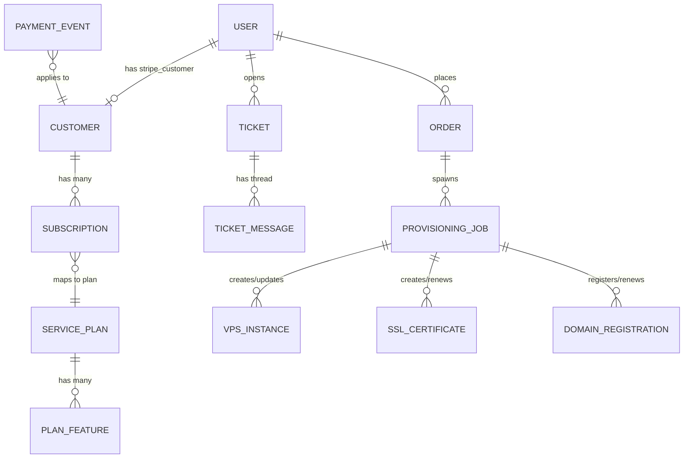

# Building EZ Solutions: Production‑grade Django SaaS Standards, Security, OSS Stack, and Roadmap

## Executive summary

“SaaS” (Software as a Service) means customers access your software over the internet (usually via a subscription), and you operate the infrastructure, updates, uptime, backups, billing, and support. A hosting/services business portal (like EZ Solutions) often behaves *like* SaaS even if you’re also delivering human services (Linux support, “vibe-coded” projects, managed VPS), because you still need secure accounts, payments, entitlements, service fulfillment/provisioning workflows, and an operational support surface.

Your repo already contains far more than “just templates”: it has a working Django monolith structure with a custom user model, a service-plan catalog, Stripe Checkout + webhooks, a support tickets system, and a small REST API. That means you are not at “30% planning” anymore; you have an early functional “service portal” foundation. The main gaps are: production settings hardening, idempotent/queue-based webhook processing, provisioning orchestration (Proxmox), domain/SSL automation, and a clearer separation between “catalog/billing/entitlements” versus “fulfillment/provisioning jobs.”

To stay sane as an IT generalist using AI coding agents, the industry-standard approach is: keep the Django app as the “source of truth” for customers/orders/entitlements; use Stripe-hosted payment surfaces (Checkout + Customer Portal) to reduce PCI scope; process Stripe webhooks asynchronously and idempotently; implement provisioning as background jobs (Celery worker) that call vendor APIs (Proxmox, DNS provider, domain registrar, control panels) using least-privilege tokens; and adopt a phased roadmap with explicit acceptance criteria and quality gates. Stripe explicitly recommends asynchronous webhook processing and guarding against duplicate deliveries; they also note event ordering is not guaranteed. citeturn13search1turn1search1

For security and compliance: follow Django’s deployment checklist and `check --deploy`, enforce HTTPS + secure cookies, use CSRF protection for session-based auth, implement CSP/HSTS carefully, and treat secrets as a lifecycle-managed asset. citeturn0search0turn0search6turn5search1turn4search12turn4search0turn3search0turn3search4

Enabled connectors used for this report: **github** (repo inspection), plus high-quality web sources (Django/Stripe/OWASP/PCI SSC/Proxmox docs).

## Current repository state and repo map

### Repo-state assumptions vs observed reality

You asked to start from these assumptions:

- scaffolding + templates present  
- apps exist but “empty”  
- `.env.example` exists with Stripe keys, but “no integration”  

After inspecting `iamez/ez-solutions` on the `main` branch (via GitHub connector), those assumptions are only partially true:

- **True:** You have a solid scaffold; templates are present; `.env.example` exists but retrieving it was blocked by safety checks (so its exact content is unverified here).  
- **Not true anymore:** Several apps are already implemented (models + views + URLs), including **Stripe Checkout + webhook handling**, ticketing, and a DRF API.  
- **Partially true:** Some areas are still placeholders (notably `domains/` models). Several “enhancement package” modules exist but contain placeholder stubs and are not wired into Django settings yet.

### Concise repo map

#### Top-level structure (observed)
- `manage.py` (sets `DJANGO_SETTINGS_MODULE` to `config.settings.dev`)
- `config/` (Django project config)
  - `settings/base.py` (viewed)
  - `settings/dev.py` (exists but fetch blocked by safety checks)
  - `settings/prod.py` (exists but fetch blocked by safety checks)
  - `urls.py`, `wsgi.py`, `asgi.py` (viewed)
- First-party Django apps:
  - `home/`
  - `users/`
  - `services/`
  - `orders/`
  - `tickets/`
  - `api/`
  - `domains/` (placeholder models)
- Presentation:
  - `templates/` (Bootstrap-based pages + allauth templates)
- Dependencies/quality:
  - `requirements/base.txt`, `requirements/dev.txt`
  - `pyproject.toml` (ruff/black/pytest/bandit config)
  - `.pre-commit-config.yaml`
  - `.github/workflows/ci.yml`
- Extra modules (present but mostly placeholders):
  - `email_system/`, `automation/`, `security/`, `customer_experience/`, `operations/`
  - `docs/` (contains stub `DISASTER_RECOVERY.md`)
  - `ai_instructions_copilot_instructions_readme/README.md` (describes an “enhancement package” intended to be copied/merged)

### Endpoints map (from `config/urls.py`)

Routing is currently:

- Admin: `/admin/`
- Public pages: `/` (home), `/about/`, `/robots.txt` via `home.urls`
- Auth (allauth): `/accounts/…`
- User dashboard namespace: `/dashboard/…` via `users.urls`
- Tickets: `/tickets/…` via `tickets.urls`
- Services catalog: `/pricing/…` and `/pricing/<slug>/…` via `services.urls`
- Billing:
  - `/billing/` (billing page)
  - `/billing/portal/` (Stripe Customer Portal)
  - `/billing/checkout/<plan_slug>/` (Starts Stripe Checkout)
  - `/webhooks/stripe/` (Stripe webhook endpoint)
- REST API:
  - `/api/health/` (liveness)
  - `/api/v1/me/`
  - `/api/v1/plans/`
  - `/api/v1/tickets/…`

This matches a reasonable “public landing → pricing → checkout → dashboard” funnel.

### Models map (as implemented vs missing)

Implemented models (high value):

- `users.User` custom user model with `subscription_tier` field and email as login identifier.
- `services.ServicePlan` + `services.PlanFeature` for plan cards; supports Stripe monthly/annual price IDs.
- `orders.Customer`, `orders.Subscription`, `orders.PaymentEvent` (Stripe object mirroring + event log).
- `tickets.Ticket`, `tickets.TicketMessage` and enums for status/priority.
- `domains.models` is currently a placeholder (“Add domain models here.”).

A key design gap: there is no “provisioning job/resource” abstraction yet (e.g., VPS instance, hosting account, SSL cert record, domain registration, asynchronous fulfillment tasks). That gap is the bridge between “billing” and “you actually deliver the service.”

### Missing pieces worth calling out as “production blockers”

- Production settings cannot be verified in this report (blocked access), so you must validate:
  - `DEBUG=False`, secure cookies, HSTS strategy, allowed hosts, trusted proxies, CSRF/CORS, etc. citeturn0search0turn0search6
- Stripe webhook handling exists, but would benefit from stricter idempotency + async queue processing per Stripe best practices. citeturn13search1turn1search1
- No first-class provisioning/fulfillment system; no Proxmox integration code yet.
- Security/automation modules exist but are stubs and not integrated.
- Tests are largely missing (CI exists, but app test coverage likely minimal).

## Architecture patterns and canonical data model for a production-grade portal

### Reference architecture pattern to aim for

The simplest architecture that scales and remains maintainable for a small team is:

- **Django monolith** (portal + admin + REST API)
- **PostgreSQL** as the system of record
- **Redis** for caching + as Celery broker/result backend
- **Celery** worker(s) for background tasks
- **Separate “Provisioning” boundary** (still in the monolith as an app or module) that calls:
  - Proxmox API for VPS lifecycle
  - DNS provider / registrar APIs
  - Control panel APIs (if you adopt OSS control panels)
- **Observability stack** (Sentry + Prometheus/Grafana + centralized logs)

This is conceptually aligned with “production-ready templates” like Cookiecutter Django: 12‑factor settings, dev/prod separation, secure defaults, and django-allauth integration. citeturn12search3

### Visual architecture diagram

```mermaid
flowchart LR
  subgraph Client[Client]
    B[Browser / Mobile]
  end

  subgraph Edge[Edge]
    RP[Reverse Proxy\nNginx/Traefik/Caddy]
  end

  subgraph App[Django Monolith]
    DJ[Django + Templates\n(home/users/services/orders/tickets)]
    API[DRF API\n(/api/v1)]
    CEL[Celery Worker\n(provisioning/jobs/webhooks)]
  end

  subgraph Data[Data Stores]
    PG[(PostgreSQL)]
    RD[(Redis)]
    OBJ[(Object Storage\nS3-compatible)]
  end

  subgraph External[External Services]
    ST[Stripe]
    PX[Proxmox VE]
    SUP[Chat/Helpdesk OSS\n(Chatwoot/Zammad)]
    DNS[DNS/Registrar\n(Cloudflare/Registrar)]
    MAIL[Email Provider\n(Mailgun/SES)]
    OBS[Observability\n(Sentry/Prometheus/Grafana)]
  end

  B -->|HTTPS| RP --> DJ
  B -->|HTTPS| RP --> API
  DJ <--> PG
  DJ <--> RD
  DJ --> OBJ
  DJ --> ST
  DJ --> SUP
  DJ --> MAIL
  ST -->|webhooks| RP --> DJ
  DJ -->|enqueue| RD --> CEL
  CEL --> PG
  CEL --> PX
  CEL --> DNS
  DJ --> OBS
  CEL --> OBS
```

### Canonical data model you should expect

You already have core entities. For a hosting/services platform, the “complete” model usually needs:

- Identity: `User`
- Billing identity: `Customer` (Stripe customer mapping)
- Catalog: `ServicePlan`, `PlanFeature`
- Subscription state: `Subscription` (Stripe subscription mirror)
- Payments/events: `PaymentEvent` (processed Stripe events), plus optional `Invoice` mirror if needed
- Entitlements: a normalized way to translate “subscription tier” into allowed features
- Fulfillment:
  - `Order` (service request)
  - `ProvisioningJob` (async workflow state machine)
  - `Resource` models per service type:
    - `VPSInstance` (Proxmox VMID, assigned IP, status)
    - `HostingAccount` (control panel user/site)
    - `DomainRegistration` (registrar order + renewal)
    - `SSLCertificate` (issuance/renewal state)
- Support:
  - `Ticket`, `TicketMessage`
  - optionally `Conversation` (if integrating a live chat platform)

A useful rule: **Stripe objects are not your domain model**. Stripe says webhooks are for “monitor events and provision access,” and you should design so your provisioning logic doesn’t depend on event ordering. citeturn1search0turn13search1

### Visual data model sketch



## Authentication, sessions vs JWT, and admin hardening

### Django auth vs django-allauth

Your repo uses **django-allauth** for accounts and provides login/signup templates. It’s a strong choice because it supports email verification, enumeration prevention, rate limits, and optional MFA, and can serve “classic web” and “API/headless” scenarios. citeturn12search1turn12search2

Cookiecutter Django also defaults to django-allauth for “production-ready” projects, reinforcing this as an industry standard default for Django SaaS. citeturn12search3

**Recommendation:** keep django-allauth, but configure it deliberately:

- Email verification: “mandatory” for paid services
- Enumeration prevention: keep enabled
- Add MFA (TOTP/passkeys) later for staff and high-value customers (allauth supports MFA). citeturn12search2

### Session vs JWT

In your repo:

- The HTML site uses sessions (normal Django behavior).
- The DRF API uses DRF permissions; session auth will work automatically for logged-in browsers unless you explicitly change auth classes.

Industry-standard guidance:

- Use **session authentication** for browser-based dashboards because it fits CSRF protections and Django’s built-in security model. DRF docs explicitly note SessionAuthentication is appropriate for same-session AJAX clients, but you must include CSRF tokens for unsafe methods. citeturn12search0turn5search1
- Use **JWT** only if you truly need third-party clients (mobile apps, CLI customers, external integrations). DRF docs describe JWT as a common option via `djangorestframework-simplejwt`. citeturn12search0

Practical approach for EZ Solutions:

- **Phase 0–2:** sessions only (simplest, safest).
- **Phase 3+:** add JWT for specific API use cases (e.g., API keys for provisioning bots or customer automation). Keep the browser dashboard session-based.

### Admin hardening standard

Django’s deployment checklist emphasizes production settings correctness and `check --deploy` use. citeturn0search0turn0search6

For admin specifically, standard hardening patterns include:

- Force HTTPS site-wide and set secure cookie attributes (below). citeturn0search0turn3search0
- Put admin behind:
  - IP allowlisting (VPN-only) and/or
  - SSO or MFA for staff
- Ensure “least privilege” staff accounts; don’t use a shared admin account. OWASP Top 10 highlights broken access control as a leading risk. citeturn3search2turn3search7

## Billing with Stripe: Checkout, webhooks, idempotency, and mapping objects to models

### Recommended billing flow for your business type

For a portal that sells subscriptions + services, the mainstream approach is:

- Use **Stripe Checkout** (hosted) for subscription purchases.
- Provision/entitle the user after receiving **webhooks** (not after redirect).
- Use **Stripe Customer Portal** for self-service subscription management.

Stripe’s subscription guide is explicitly about using Checkout to sell fixed-price subscriptions and using events to provision access, plus the customer portal for subscription management. citeturn1search0turn1search2turn13search0

This is already what your repo is doing structurally.

### Stripe webhook security and reliability requirements

Stripe requires signature verification using the `Stripe-Signature` header and the **raw** request body. They explicitly warn that frameworks must not mutate the body before verification. citeturn1search1turn1search3

Stripe best practices also state:

- events can arrive **out of order**
- your endpoint may receive the **same event more than once**
- handlers should be **asynchronous** (queue-based processing) citeturn13search1

These three requirements are the crux of “production-grade Stripe integration.”

### Idempotency keys for Stripe API calls

Stripe’s idempotency guidance explains that clients can supply an `Idempotency-Key` header for POST requests so retries don’t double-charge or double-create objects. citeturn13search2

For EZ Solutions, the two idempotency layers you need are:

1. **Outbound Stripe API calls** (create checkout session, create portal session, etc.)  
   - Use idempotency keys derived from `(user_id, plan_id, timestamp bucket)` to prevent accidental duplicates.
2. **Inbound webhooks** (Stripe → you)  
   - Use `event.id` as the idempotency key and store it before processing.

### Mapping Stripe objects to local models

A proven pattern:

- `Customer` (local) stores:
  - `user` FK
  - `stripe_customer_id`
- `Subscription` (local) stores:
  - `stripe_subscription_id`
  - `status`, `cancel_at_period_end`, `current_period_end`, `plan` FK
- `PaymentEvent` (local) stores:
  - `stripe_event_id` (unique)
  - `type`, `livemode`, `payload` (json)
  - processing status timestamps

Your repo already follows broadly this idea.

The important improvement: treat `PaymentEvent` like an **inbox table** (durable queue). Insert first, then process exactly once.

### Concrete implementation pattern: signature verification + idempotent processing

Minimal Django pattern (recommended shape). It follows Stripe’s “raw body + signature verification” requirement citeturn1search1turn1search3 and Stripe’s “handle duplicate events” guidance citeturn13search1:

```python
# orders/webhooks.py (or orders/views.py)
import json
import stripe
from django.conf import settings
from django.db import transaction
from django.http import HttpResponse
from django.views.decorators.csrf import csrf_exempt

from .models import PaymentEvent

@csrf_exempt
def stripe_webhook(request):
    payload = request.body  # IMPORTANT: raw bytes
    sig_header = request.META.get("HTTP_STRIPE_SIGNATURE", "")

    try:
        event = stripe.Webhook.construct_event(
            payload=payload,
            sig_header=sig_header,
            secret=settings.STRIPE_WEBHOOK_SECRET,
        )
    except (ValueError, stripe.error.SignatureVerificationError):
        return HttpResponse(status=400)

    # 1) Create-or-return (idempotency gate) inside a transaction
    with transaction.atomic():
        obj, created = PaymentEvent.objects.get_or_create(
            stripe_event_id=event["id"],
            defaults={
                "event_type": event["type"],
                "livemode": event.get("livemode", False),
                "payload": event,          # store full event payload
                "status": "received",
            },
        )

        if not created:
            # Stripe can retry or send duplicates; returning 2xx stops retries. citeturn13search1
            return HttpResponse(status=200)

        # Option A: enqueue async processing (recommended by Stripe). citeturn13search1
        # process_stripe_event.delay(obj.id)

        # Option B (not ideal): process synchronously, but keep it short.
        obj.status = "processing"
        obj.save(update_fields=["status"])

    # If using async queue, return immediately:
    return HttpResponse(status=200)
```

Key points this enforces:

- Signature verification occurs before any processing. citeturn1search3turn1search1
- Raw body is used; no JSON re-serialization. citeturn1search1turn1search3
- Duplicate events become a safe no-op because `stripe_event_id` is unique and inserted first. citeturn13search1
- Processing can be offloaded to a queue, which Stripe recommends. citeturn13search1

### Webhook replay and failure handling

Stripe allows you to view/resend events in the Dashboard with retention constraints (full payload and resend availability depend on event age). Stripe documents that full payload is available for up to ~30 days via API for retrieval, and Dashboard behavior differs by age. citeturn1search4turn13search1

Operationally, that means:

- You should keep `PaymentEvent.payload` (or at least the critical identifiers) long enough to reconcile.
- Add an internal admin UI (or management command) to re-run provisioning for a subscription/customer if the system was down.

## Security hardening, compliance, and privacy

### Django deployment checklist and `check --deploy`

Django’s deployment checklist emphasizes that “the internet is a hostile environment” and provides concrete settings you must configure, plus recommends running `manage.py check --deploy` against production settings. citeturn0search0turn0search6

Baseline production requirements (non-exhaustive, but core):

- `DEBUG=False` in production citeturn0search1turn0search0
- `SECRET_KEY` must be secret and not committed citeturn0search1
- `ALLOWED_HOSTS` must be set, and your reverse proxy should also validate host headers citeturn0search0turn0search1

### HTTPS, secure cookies, and session security

OWASP session management guidance states you should use HTTPS for the entire session and set `Secure`, `HttpOnly`, and `SameSite` cookie attributes appropriately. citeturn3search0

For Django, this typically translates into:

- Strict HTTPS enforcement via your reverse proxy, plus Django `SecurityMiddleware` settings. Django’s security docs emphasize HTTPS is always better and provides steps like `SECURE_PROXY_SSL_HEADER` when behind proxies. citeturn0search3turn0search0
- Secure session and CSRF cookies (`SESSION_COOKIE_SECURE`, `CSRF_COOKIE_SECURE`) once HTTPS is enabled. citeturn0search0turn3search0

### CSRF and XSS

Django’s CSRF guide recommends leaving `CsrfViewMiddleware` enabled and using `` in POST forms; it also documents how to attach CSRF tokens to AJAX requests. citeturn5search1

Django’s security overview explains that Django templates escape output by default to mitigate XSS, but developers must understand limitations (e.g., misuse of “safe” rendering). citeturn0search3

### Security headers: clickjacking, CSP, HSTS

Django clickjacking docs explain `X-Frame-Options` via middleware and the `X_FRAME_OPTIONS` setting. citeturn5search3

For CSP, OWASP provides guidance that CSP is best delivered via HTTP response headers and can significantly reduce XSS exploitability when configured strictly. citeturn3search4

For HSTS, OWASP describes recommended headers (`max-age`, `includeSubDomains`, `preload`) and warns that preload has irreversible consequences if you break HTTPS later. citeturn4search0turn4search1

### Secrets management

OWASP’s Secrets Management Cheat Sheet frames secrets as lifecycle-managed assets (creation, rotation, revocation, expiration) and cautions against secrets in code/config. citeturn4search12

For EZ Solutions that means:

- All secrets **only** in environment variables or a secrets manager (not in `.env` committed).
- Separate Stripe test vs live keys; separate DB creds; rotate tokens regularly.
- Use least-privilege API tokens for Proxmox and registrars.

### Password policies and storage

OWASP recommends Argon2id (or scrypt) as a preferred password hashing approach, and provides minimum recommendations. citeturn4search3

Django supports strong password hashing by default; you should ensure you do not override it with insecure settings.

### GDPR and breach response

Because you’re in Europe, GDPR is the relevant baseline privacy regime. GDPR Article 32 requires “appropriate” security measures based on risk, and Article 33 requires breach notification to the supervisory authority within 72 hours in many cases. citeturn6search12turn6search0

Translate this into engineering controls:

- Data minimization and retention policies (don’t store what you don’t need)
- Audit logs and incident response runbooks (who does what, when)
- Backup and restore drills (prove RTO/RPO)
- Ability to delete/anonymize user data on request (where feasible)

### PCI scope and Stripe-hosted pages

Stripe states PCI compliance is a **shared responsibility**, Stripe is a PCI Level 1 Service Provider, but you must integrate in a PCI-compliant manner and attest annually. citeturn6search2turn6search6

Using hosted payment pages (e.g., Stripe Checkout) is a common way to significantly reduce PCI scope compared to directly handling card data.

PCI SSC guidance on SAQ A eligibility (for iframe-based payment pages) emphasizes that **all elements of the payment page** must originate only and directly from a validated third-party service provider to remain eligible. citeturn6search1

**Practical takeaway:** keep all card data collection inside Stripe-hosted surfaces (Checkout/Portal). Do not embed your own card forms unless you’re ready for the compliance and security burden.

## Testing, CI quality gates, and secure engineering practices

### Existing quality gates in your repo

Your repo includes:

- `pyproject.toml` configuration for formatting/linting/testing/security tooling.
- `.pre-commit-config.yaml` (pre-commit hooks).
- `.github/workflows/ci.yml` (CI pipeline).
- `requirements/dev.txt` includes pytest/pytest-django, ruff, black, bandit, pip-audit.

This is a strong start. The operational standard is to make CI the “contract” that every AI-generated change must satisfy (format, lint, tests, security scan).

### Testing strategy for your domain

For a subscription + provisioning portal, you want three layers:

- Unit tests: pure Python domain logic (entitlements, plan selection, state transitions).
- Integration tests: Django views, login flows, ticket workflows.
- Webhook tests: feed Stripe webhook payload fixtures into your endpoint and assert:
  - signature verification is required
  - duplicate event IDs are idempotent no-ops
  - out-of-order events don’t corrupt state (Stripe warns ordering is not guaranteed). citeturn13search1

Stripe also recommends asynchronous webhook handling; tests should validate you enqueue background jobs and return 2xx quickly. citeturn13search1

### Security scanning and dependency hygiene

- Use `pip-audit` in CI to detect vulnerable dependencies.
- Use `bandit` for basic static checks.
- Keep Django patched (Django security releases are frequent in the ecosystem; treat upgrades as routine).

OWASP Top 10 includes “Vulnerable and Outdated Components” as a primary risk area—this is exactly what dependency scanning addresses. citeturn3search2

## Deployment, Proxmox integration, observability, and incident response

### Recommended infra baseline

A production-grade Django deployment commonly uses:

- Reverse proxy: Nginx/Traefik/Caddy (TLS termination, static/media, gzip/brotli, rate limiting)
- App server: Gunicorn (WSGI) for classic Django; ASGI server if you need websockets
- Database: PostgreSQL
- Cache/broker: Redis
- Background workers: Celery

Django’s database docs also discuss persistent connections and note that persistent connections should be disabled under ASGI; use pooling options if needed. citeturn5search9

### Proxmox patterns that fit a SaaS-like portal

You run Proxmox at home. For “production-grade” operations, you want a *repeatable* provisioning pipeline:

- Create VM templates using Cloud-Init so new VPS instances are created from a known-good image and configured automatically. Proxmox documents Cloud-Init images and template workflows (create VM, attach cloud-init drive, convert to template, clone). citeturn2search4
- Use Proxmox API tokens (least privilege) instead of using root username/password everywhere. Proxmox user manager CLI `pveum` supports creating tokens. citeturn0search17turn2search1
- Use the firewall at the Proxmox level to isolate management, and be cautious: Proxmox firewall is disabled by default and enabling it changes default traffic behavior; their docs describe cluster/host/vm firewall config and defaults. citeturn2search0
- Use `pvesh` for local API invocation on the Proxmox host (root only). citeturn11search11

**Integration pattern (recommended):** a `provisioning` Django app + Celery tasks:

- Task takes a `ProvisioningJob` record (desired plan, OS template, resources)
- Calls Proxmox API to clone template, set CPU/RAM/disk, set cloud-init user/SSH keys, start VM
- Updates `VPSInstance` record with VMID and state
- Notifies customer (email + dashboard status)

### Observability and incident response

For logging:

OWASP Logging Cheat Sheet emphasizes logging authentication failures, authorization failures, input validation failures, and protecting logs from tampering. citeturn7search1turn7search3

For alerting:

Grafana’s alerting best practices emphasize symptom-based alerts (latency/errors/availability) and avoiding noisy infra-only paging. citeturn7search0  
Prometheus Alertmanager handles deduplication, grouping, routing, silences, and inhibition. citeturn8search1

For error tracking:

Use the official Sentry Python SDK; their official repository shows standard initialization via `sentry-sdk`. citeturn8search15

For GDPR breach response:

72-hour notification requirements drive the need for a prepared incident process and detection/monitoring. citeturn6search0

## Roadmap, OSS stack candidates, environment variables, and deliverables

### MVP scope recommendation

Given your offering (VPS, hosting/websites, Linux support, “vibe coding”), the recommended MVP is **not** “automated cPanel competitor.” It is:

- Public marketing site + pricing
- Auth + dashboard
- Stripe subscriptions
- A “service request” workflow (customer can request a VPS, a website build, or Linux support)
- A support inbox (tickets, and later live chat)
- A fulfillment pipeline that can be *manual at first* but is tracked in the system (jobs, statuses, audit trail)

This keeps complexity manageable while still delivering real value.

### OSS-first strategy: what you can realistically reuse

You asked specifically to “use already made software” and even “copy whole open source community” where possible. The pragmatic approach is to **integrate** rather than fork/duplicate:

- **Customer support + live chat:**  
  - Chatwoot: open-source omnichannel support desk + live chat widget; also advertises an AI agent (“Captain”) and help center features. citeturn10search1turn10search4  
  - Zammad: open-source helpdesk/ticketing system, AGPL-licensed; designed for multi-channel support. citeturn11search0turn11search9

- **Web hosting control panel (websites/email/DNS):**  
  - HestiaCP (GPL): for deploying and managing web/mail/DNS/db services. citeturn10search3  
  - ISPConfig (open source): supports multi-server management and typical hosting daemons. citeturn10search6  
  - CyberPanel (OpenLiteSpeed-based): geared toward fast web hosting control. citeturn10search14turn10search7

- **Billing model syncing library (optional):**  
  - dj-stripe: a Django library that syncs Stripe objects into Django models and helps handle webhooks. Stripe lists it as a Django community SDK. citeturn9search0turn9search1

- **AI chatbots (optional):**  
  - Rasa: open-source conversational AI framework; useful if you want deterministic workflows around orders/support intake rather than only LLM chat. citeturn11search4

**Licensing note:** some of these are GPL/AGPL (Zammad AGPL, HestiaCP GPL). If you embed/modify and distribute in certain ways, you may have obligations. If you *integrate as a separate service* (e.g., host Chatwoot or Zammad alongside your Django portal), obligations differ. Treat this as something to review carefully for your deployment model.

### Comparison tables

#### Auth and identity options

| Option | Best for | Pros | Cons |
|---|---|---|---|
| Django sessions + django-allauth | Web dashboard + normal browser flows | Mature, secure defaults; supports email verification and MFA; aligns with Cookiecutter Django patterns. citeturn12search3turn12search2 | API-first clients may need extra work |
| DRF SessionAuthentication | Browser-based API calls | Works with Django session; DRF docs describe CSRF requirements. citeturn12search0turn5search1 | Requires CSRF discipline for unsafe methods |
| JWT (DRF simplejwt) | Mobile apps, external clients | Stateless auth; scalable | More security surface (token storage, refresh, revocation), easier to mis-implement |

#### Billing flow options

| Billing flow | PCI/compliance burden | UX control | Recommended for EZ Solutions |
|---|---:|---:|---|
| Stripe Checkout subscriptions + Customer Portal | Lower (hosted pages); Stripe provides PCI guidance. citeturn6search2turn6search6 | Medium (hosted UI) | **Yes** (best default) citeturn1search0turn13search0 |
| Custom payment forms (Elements/PaymentIntents) | Higher | High | Only if you need deep checkout customization |
| “Invoice/pay link” model | Lower | Lower | Good for manual/consulting services; can coexist with subscriptions |

#### OSS components for your “don’t reinvent” goal

| Need | OSS candidates | Notes |
|---|---|---|
| Support inbox + chat widget | Chatwoot citeturn10search1 | Modern UI, omnichannel, self-hostable; has AI agent messaging in docs. citeturn10search4 |
| Ticketing/helpdesk | Zammad citeturn11search0 | Mature helpdesk workflow; AGPL license. |
| Web hosting control | HestiaCP citeturn10search3, ISPConfig citeturn10search6, CyberPanel citeturn10search14 | Use as separate service; integrate via API or automation, not by rewriting. |
| Stripe model syncing | dj-stripe citeturn9search0turn9search1 | Optional; reduces custom webhook/model work but adds dependency complexity. |

### Recommended environment variables

This list is tailored to your repo and to production-grade needs. Treat names as canonical; values depend on environment.

**Django core**
- `DJANGO_SECRET_KEY`
- `DJANGO_DEBUG`
- `DJANGO_ALLOWED_HOSTS`
- `DJANGO_CSRF_TRUSTED_ORIGINS` (recommended)
- `SITE_URL` (used for building absolute URLs in billing redirects)

**Database**
- `DATABASE_URL` (Postgres connection string)

**Redis / Celery**
- `REDIS_URL`
- `CELERY_BROKER_URL`
- `CELERY_RESULT_BACKEND`

**Stripe**
- `STRIPE_SECRET_KEY`
- `STRIPE_PUBLISHABLE_KEY`
- `STRIPE_WEBHOOK_SECRET`

**Email (since you include Anymail + Mailgun in requirements)**
- `EMAIL_HOST` / `EMAIL_PORT` / `EMAIL_HOST_USER` / `EMAIL_HOST_PASSWORD` (if SMTP)
- `MAILGUN_API_KEY`, `MAILGUN_SENDER_DOMAIN` (if Mailgun)
- `DEFAULT_FROM_EMAIL`

**Storage**
- `AWS_ACCESS_KEY_ID`, `AWS_SECRET_ACCESS_KEY`, `AWS_STORAGE_BUCKET_NAME`, `AWS_S3_REGION_NAME` (if using S3 via django-storages)

**Observability**
- `SENTRY_DSN` (Sentry SDK DSN) citeturn8search15

**Proxmox integration (future)**
- `PROXMOX_API_URL` (e.g., `https://pve-host:8006`)
- `PROXMOX_TOKEN_ID` (token “full-tokenid” form)
- `PROXMOX_TOKEN_SECRET` (store securely; shown once when created) citeturn2search1
- `PROXMOX_VERIFY_SSL` (true/false)
- `PROXMOX_TEMPLATE_VMID` (cloud-init template)
- `PROXMOX_DEFAULT_NODE`, `PROXMOX_DEFAULT_STORAGE`

### Required third-party services

Even if you *self-host everything*, you still depend on some external systems:

- entity["company","Stripe","payments company"] account (billing, Checkout, webhooks) citeturn1search0turn13search1turn6search2
- Email delivery provider:
  - entity["company","Mailgun","email delivery service"] (already in requirements) or similar
- DNS/registrar provider (for domain management), optional in MVP:
  - entity["company","Cloudflare","cdn and dns company"] (DNS + API) or a registrar API
- entity["company","Proxmox Server Solutions GmbH","virtualization vendor"] product stack for VPS provisioning citeturn2search4turn2search0turn2search1
- Observability:
  - entity["company","Sentry","error monitoring platform"] for error tracking citeturn8search15
  - entity["company","Grafana Labs","observability company"] + Prometheus stack for metrics/alerting citeturn7search0turn8search1
- Security standards guidance baseline:
  - entity["organization","OWASP","web app security org"] cheat sheets for sessions/CSP/HSTS/logging/secrets citeturn3search0turn3search4turn4search0turn4search12turn7search1
  - entity["organization","PCI Security Standards Council","payments security standards org"] for PCI SAQ eligibility criteria guidance citeturn6search1turn6search10

### Prioritized Phase checklist with acceptance criteria

Below is a Phase 0–4 plan that fits your repo and your “AI agent assisted coding” workflow.

#### Phase 0: Stabilize foundations

**Goal:** Project is runnable locally and in a staging environment with secure defaults and CI gates enforced.

Acceptance criteria:
- CI passes (ruff, black, bandit, pip-audit, pytest).  
- `python manage.py check --deploy` passes when run against production settings (or warnings are explicitly silenced with justification). citeturn0search6turn0search0  
- HTTPS is handled correctly behind reverse proxy; secure cookies configured; CSRF works on all forms. citeturn0search0turn5search1turn3search0  
- Stripe keys are configured only via env; no secrets in repo. citeturn4search12  
- Staging has working Stripe test mode Checkout and webhook signature verification. citeturn1search3turn13search1  

#### Phase 1: Make billing + entitlements robust

**Goal:** Subscription purchase reliably updates entitlements and dashboard state.

Acceptance criteria:
- Checkout → webhook → subscription activated works even if:
  - events arrive out of order citeturn13search1  
  - duplicated events are delivered citeturn13search1  
- Webhook handling enqueues async processing and returns 2xx quickly. citeturn13search1  
- `PaymentEvent` acts as an inbox log; event processing is idempotent by `event.id`. citeturn13search1  
- Customer Portal works (`/billing/portal/`). citeturn13search0  
- User dashboard displays plan + renewal date correctly.

#### Phase 2: Turn “services” into tracked fulfillment

**Goal:** Customers can request a VPS / website project / support, and you have internal tracking.

Acceptance criteria:
- Introduce `Order` and `ProvisioningJob` models (or equivalent) with state machine:
  - `queued → running → needs_info → complete/failed`
- Every paid plan grants entitlements that define what can be ordered.
- Support tickets already exist; connect them to orders (optional but strong).
- Audit logging exists for state changes (minimal).

#### Phase 3: Proxmox-backed VPS provisioning

**Goal:** Automated provisioning for the VPS path (even if other services remain manual).

Acceptance criteria:
- Proxmox API token configured with least-privilege. citeturn2search1turn0search17  
- VM template workflow uses Cloud-Init images/templates. citeturn2search4  
- Provisioning job can create a VPS instance reliably and update status.
- Firewall isolation strategy documented and applied. citeturn2search0  
- Rollback: failed provisioning cleans up VM resources or marks them for manual cleanup.

#### Phase 4: Mature operations, compliance, and scale

**Goal:** Durable production operations.

Acceptance criteria:
- Backup/restore drills (DB + media) documented and tested.
- Centralized logging + alerting on symptoms; alert routing and deduplication configured. citeturn7search0turn8search1turn7search1  
- Sentry integrated and verified with a test endpoint. citeturn8search15  
- GDPR incident response plan (incl. 72-hour requirement) documented. citeturn6search0  
- PCI documentation: integration uses hosted payment surfaces; SAQ scope understood. citeturn6search2turn6search1turn6search10  

### Gantt-style roadmap timeline

```mermaid
gantt
    title EZ Solutions Phased Roadmap
    dateFormat  YYYY-MM-DD
    axisFormat  %b %d

    section Foundations
    Phase 0: Repo hardening, env, CI, staging      :a0, 2026-02-18, 14d

    section Billing & Entitlements
    Phase 1: Webhooks idempotency + async tasks    :a1, after a0, 21d

    section Fulfillment Layer
    Phase 2: Orders + provisioning job tracking    :a2, after a1, 21d

    section Proxmox VPS Automation
    Phase 3: Cloud-init template + VM provisioning :a3, after a2, 28d

    section Operations & Compliance
    Phase 4: Monitoring, backups, DR, GDPR, PCI    :a4, after a3, 28d
```

## Proposed docs updates and additions

The following are “ready to paste” contents for the repo.

### `/docs/OSS_STACK_CANDIDATES.md`

```md
# OSS Stack Candidates for EZ Solutions

## Purpose

EZ Solutions aims to avoid reinventing complex systems (hosting panels, helpdesk/live chat, provisioning toolchains) by integrating proven open-source products where possible and keeping Django focused on:
- customer identity + portal UX
- billing + entitlements
- fulfillment tracking (orders/jobs/resources)
- operational visibility

## Customer Support / Live Chat / Helpdesk

### Chatwoot (recommended for live chat + omnichannel)
- Type: open-source customer support platform (live chat widget + channels).
- Integration pattern: run as a separate service; connect via webhooks/API; embed widget in Django templates.
- Pros: modern UI, self-hostable, has built-in help center and AI assistant positioning.
- Cons: separate stack (Ruby/Vue/Postgres/Redis), requires ops.

Source: https://github.com/chatwoot/chatwoot

### Zammad (recommended for ticket-centric helpdesk)
- Type: open-source helpdesk / ticketing.
- Integration pattern: separate service; SSO optional; link tickets via API.
- Pros: mature ITSM/helpdesk workflows.
- Cons: AGPL licensing considerations; separate ops.

Source: https://github.com/zammad/zammad

## Hosting Control Panels (Websites / Email / DNS / Databases)

These are not “Django libraries”. Treat them as separate services to manage hosting resources while Django remains the customer portal.

### HestiaCP
- Good for: shared hosting style websites, mail, DNS, Let’s Encrypt, DBs.
- Fit: “website hosting” line of business.
- Source: https://github.com/hestiacp/hestiacp

### ISPConfig
- Good for: multi-server hosting management; typical hosting daemons.
- Fit: scaling beyond one host.
- Source: https://www.ispconfig.org/

### CyberPanel
- Good for: OpenLiteSpeed-based hosting (performance-oriented).
- Fit: WordPress-heavy hosting SKUs.
- Source: https://cyberpanel.net/

## AI Chatbot / Agent Frameworks

### Rasa
- Good for: deterministic “support intake” flows, tool calling, low-hallucination workflows.
- Fit: “AI assistant that takes orders” where you need structured outcomes.
- Source: https://github.com/RasaHQ/rasa

## Stripe Billing Libraries (Optional)

### dj-stripe
- Good for: syncing Stripe objects into Django ORM automatically.
- Fit: if you want to reduce custom Stripe model maintenance.
- Risk: still requires careful webhook/event handling; adds dependency complexity.
- Source: https://github.com/dj-stripe/dj-stripe

## Recommendation

Start with:
- Stripe Checkout + Customer Portal (keep payment pages hosted)
- Django portal for entitlements + fulfillment tracking
- Chatwoot for live chat + omnichannel support

Add later:
- ISPConfig/HestiaCP/CyberPanel depending on hosting SKU
- Rasa only if you need deterministic bot workflows beyond “summaries”
```

### `/docs/PLAN.md`

```md
# EZ Solutions Implementation Plan

## Repo Reality Check (as of current main branch)

Core apps exist and are partially implemented:
- home: landing/about/robots
- users: custom user model + dashboard
- services: pricing catalog + plan features
- orders: Stripe checkout + portal + webhook endpoint + billing page
- tickets: support tickets + message threads
- api: basic REST API (health, me, plans, tickets)
- domains: placeholder (not implemented)

Quality tooling exists:
- pre-commit + ruff + black + pytest + bandit + pip-audit
- GitHub Actions CI

## Guiding Principles

- Keep the Django monolith as the system-of-record.
- Treat Stripe webhooks as the only source of truth for payment outcomes.
- Process webhooks asynchronously and idempotently.
- Add “fulfillment tracking” before attempting full automation.
- Prefer integrating OSS (helpdesk/control panels) rather than rebuilding them.

## Phase Checklist

### Phase 0 — Foundations
- Ensure prod settings are correct (DEBUG false, allowed hosts, secure cookies, HSTS plan).
- Run manage.py check --deploy against prod settings.
- Confirm Stripe test-mode end-to-end with signature verified webhooks.
- Ensure CI must pass for every change.

### Phase 1 — Billing + Entitlements
- Make webhooks idempotent by event.id (PaymentEvent inbox table).
- Move webhook processing to Celery (return 2xx quickly).
- Define entitlements mapping: plan -> allowed services.
- Dashboard shows current plan/subscription renewal and “what you can order”.

### Phase 2 — Fulfillment Tracking
- Add Order + ProvisioningJob models and admin UI.
- Track service delivery status for:
  - VPS request
  - website build request
  - Linux support request
- Link support tickets to orders.

### Phase 3 — Proxmox Provisioning MVP
- Create Proxmox cloud-init template VM.
- Implement Celery task to clone/start VM via Proxmox API token.
- Create VPSInstance model (vmid, node, ip, status, credentials delivery method).
- Add rollback paths and operator runbook.

### Phase 4 — Production Ops
- Backups (DB + media) + restore drills.
- Centralized logging + alerting + Sentry.
- GDPR incident response and data retention policy.
- Security review cadence and patch management.
```

### `/docs/SECURITY_CHECKLIST.md`

```md
# EZ Solutions Security Checklist

This checklist is designed to align with:
- Django deployment checklist + check --deploy
- OWASP cheat sheets (sessions, CSP, HSTS, logging, secrets)
- Stripe webhook security guidance

## Environment & Secrets
- [ ] No secrets committed to git (keys, tokens, passwords).
- [ ] SECRET_KEY is set via env and rotated if leaked.
- [ ] Separate Stripe test vs live keys.
- [ ] Proxmox uses API tokens, not root password.

## Django Production Settings
- [ ] DEBUG = False in production.
- [ ] ALLOWED_HOSTS set correctly; reverse proxy rejects invalid host headers.
- [ ] SecurityMiddleware enabled and configured.
- [ ] HTTPS enforced end-to-end (proxy + app).
- [ ] SESSION_COOKIE_SECURE / CSRF_COOKIE_SECURE enabled on HTTPS.
- [ ] CSRF_TRUSTED_ORIGINS configured for your real domains.
- [ ] HSTS rolled out safely (start with low max-age; only later includeSubDomains/preload).
- [ ] Clickjacking mitigations enabled (X-Frame-Options / frame-ancestors via CSP).
- [ ] CSP implemented (start Report-Only, then enforce).

## Auth & Access Control
- [ ] django-allauth configured with email verification (mandatory for paid).
- [ ] Account enumeration prevention enabled.
- [ ] Admin protected (MFA + IP allowlist/VPN; strict staff permissions).
- [ ] Rate limit login/password reset endpoints.

## Stripe
- [ ] Webhook signature verification uses raw request body.
- [ ] Webhook processing is idempotent (event.id stored and checked).
- [ ] Webhooks handled asynchronously (Celery).
- [ ] Idempotency keys used on outbound Stripe POST calls.

## Logging & Monitoring
- [ ] Log auth failures, access control failures, input validation failures.
- [ ] Logs protected from tampering and access controlled.
- [ ] Alerts are symptom-based (latency/errors/availability).
- [ ] Incident response plan documented (GDPR 72-hour rule awareness).

## Proxmox / Infra
- [ ] Firewall isolation between management plane and customer VPS networks.
- [ ] Cloud-init templates used; no password-based provisioning when avoidable.
- [ ] Backups tested (restore drill).
```

## Final consolidated “super prompt” for Claude Code

Below is a single prompt you can paste into Claude Code (or a similar coding agent). It is tailored to your repo structure and to the Phase 0–4 program above.

```md
You are coding inside the GitHub repo: iamez/ez-solutions (Django).

## Non-negotiable rules
- Do NOT add or commit secrets. No API keys, webhook secrets, passwords, or token strings in code or docs.
- All configuration must be via environment variables. If you add env vars, update docs/PLAN.md and docs/SECURITY_CHECKLIST.md accordingly.
- Every change must pass: ruff + black + pytest + bandit + pip-audit (see pyproject.toml, requirements/dev.txt, and .github/workflows/ci.yml).
- Keep changes small, reviewable, and consistent with existing app patterns.

## Repository map (current)
- config/urls.py includes:
  - home (public): "" -> home.urls (/, /about/, /robots.txt)
  - allauth: /accounts/
  - users dashboard: /dashboard/ -> users.urls
  - services catalog: /pricing/ -> services.urls
  - orders/billing: /billing/, /billing/portal/, /billing/checkout/<plan_slug>/, /webhooks/stripe/
  - tickets: /tickets/
  - api: /api/health/ and /api/v1/*

Apps:
- users/ (custom User model; subscription_tier field)
- services/ (ServicePlan + PlanFeature; stripe_price_id_monthly/annual)
- orders/ (Customer, Subscription, PaymentEvent; Stripe integrations)
- tickets/ (Ticket, TicketMessage)
- api/ (DRF API views + serializers)
- domains/ (placeholder; not implemented)

Templates exist under templates/ (Bootstrap + allauth templates).

## Your task framework
Implement work in Phases. Do not jump ahead.

### Phase 0 (must complete first)
Goal: make project production-safe baseline.
Tasks:
1) Confirm prod settings correctness (config/settings/prod.py). Ensure Django deployment checklist items are addressed.
2) Ensure manage.py check --deploy passes (or document justified silences).
3) Add minimal tests for critical paths:
   - /pricing/ loads
   - checkout session creation requires auth and returns a redirect (mock Stripe)
   - webhook signature verification rejects invalid signature
4) Ensure CI passes locally and in GitHub Actions.

Acceptance criteria:
- ruff/black/pytest/bandit/pip-audit all pass.
- check --deploy passes for prod settings.

### Phase 1
Goal: Stripe event processing is idempotent + async.
Tasks:
1) Refactor Stripe webhook to:
   - Verify signatures using raw request.body.
   - Insert PaymentEvent row FIRST using get_or_create(stripe_event_id=event.id).
   - On duplicate, return 200 immediately.
   - Enqueue Celery task to process event; return 200 quickly.
2) Implement processing task that updates:
   - Customer stripe_customer_id
   - Subscription status/current_period_end/cancel_at_period_end
   - User.subscription_tier based on ServicePlan.tier_key
3) Add tests for duplicate event id handling and out-of-order event resilience.

Acceptance criteria:
- Duplicate webhook deliveries are safe no-ops.
- Webhook returns 2xx quickly.
- Subscription state updates correctly via webhooks (not via redirects).

### Phase 2
Goal: add fulfillment tracking.
Tasks:
1) Add new app (e.g., provisioning/) with:
   - Order model (user, service_type, plan, requested_params JSON, status)
   - ProvisioningJob model (order FK, status, logs, attempts)
2) Add admin UI for operators to manage jobs.
3) Connect tickets to orders (optional but preferred).

### Phase 3
Goal: Proxmox provisioning MVP.
Tasks:
1) Implement Proxmox API client (token-based) under provisioning/.
2) Add VPSInstance model tracking VMID/node/ip/status.
3) Celery task that clones cloud-init template, configures and starts VM.
4) Update dashboard with VPSInstance status.

### Phase 4
Goal: operational maturity.
Tasks:
1) Backups + restore drill scripts + docs.
2) Observability: Sentry integration, Prometheus metrics endpoint, Grafana dashboards references.
3) Incident response / GDPR / data retention docs.

## Coding standards
- Favor clarity over cleverness.
- Use transactions for idempotency gates.
- Avoid race conditions; prefer DB uniqueness constraints.
- No synchronous long-running work in web requests; use Celery.
- Add tests for every critical behavior change.

## Deliverables each time you finish a phase
- Code changes + tests
- Updated docs/PLAN.md and docs/SECURITY_CHECKLIST.md
- Any new env vars documented clearly
- A short “What changed / Why / How to run” summary in the PR description
```

