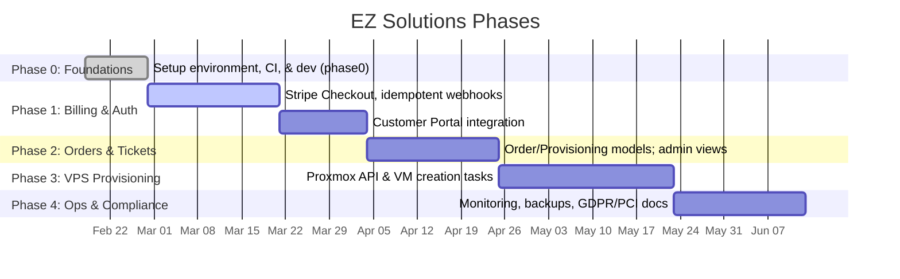

# Building EZ Solutions: Production-Grade Django SaaS Best Practices

**Executive Summary:** EZ Solutions aims to be a full-featured hosting and services SaaS (VPS hosting, websites, domains, SSL, support) built on Django. The codebase already includes a scaffold with custom user models, service plans, Stripe billing hooks, and a ticket system. To go production-ready, we should apply industry-standard architecture and security practices. This includes a well-structured project layout (influenced by Cookiecutter-Django), strict separation of dev/prod settings, environment-based configuration, and robust authentication (keeping django-allauth for accounts, using session auth for the web UI, and considering JWT only if needed for APIs). Billing should use Stripe Checkout + Customer Portal, with webhooks handled *idempotently* (storing `event.id` and enqueuing work). The data model should capture users, customers, subscriptions, orders, payment events, tickets, and eventually provisioning jobs/resources (e.g. VPSInstance, DomainRegistration). Security hardening must follow Django’s deployment checklist (DEBUG off, secure cookies, HSTS, CSP, CSRF, input validation) and OWASP guidelines (rate limiting, secrets management). We must enforce quality gates (pytest, pre-commit/ruff/black, CI) early. For deployment, use Postgres, Gunicorn, Nginx/Traefik/Caddy, with Docker or K8s if needed; integrate with Proxmox via its API tokens; ensure backups and monitoring (Prometheus, Sentry). Operational best practices include webhook replay handling, migrations strategy, blue/green deploys, and incident response (GDPR 72h notification, PCI SAQ A compliance). We propose a prioritized MVP scope: public landing, account portal, Stripe billing, orders/tickets system; followed by phased roadmap (Phase 0–4) culminating in automation and compliance. Below is a concise **Repo Map** and Phase 0 checklist, followed by in-depth sections, diagrams, tables, updated docs, and a final integrated “super prompt.”

## Current Repo State & Repo Map

**Enabled Connector:** GitHub (inspected `iamez/ez-solutions` repo via API).

- **Structure:** Django project with `manage.py`, `config/` (settings base/dev/prod), `requirements/` (base/dev), `pyproject.toml`, pre-commit config, CI workflow.
- **Apps:** `home`, `users`, `services`, `orders`, `tickets`, `api`, plus placeholder `domains`.  
- **Templates:** Bootstrap 5; includes allauth templates under `templates/account/`.
- **Auth:** Uses **django-allauth** (login/signup) with a custom `User` model (`email` login).
- **Billing:** `orders` app implements Stripe Checkout (subscription mode), Customer Portal, and a `/webhooks/stripe/` view storing events. Models: `Customer`, `Subscription`, `PaymentEvent`.
- **Support:** `tickets` app with `Ticket` and `TicketMessage` models and views.
- **Missing:** Domain/SSL models (empty); VPS provisioning models; email integration logic; advanced tests. Dev/prod settings exist but need hardening.

**Endpoints (from `config/urls.py`):**  
- Public: `/`, `/about/`, `/pricing/`.  
- Auth: `/accounts/` (allauth), `/dashboard/` (users).  
- Billing: `/billing/` (status), `/billing/portal/` (Stripe Portal), `/billing/checkout/<plan>/`, `/webhooks/stripe/`.  
- Tickets: `/tickets/`.  
- API: `/api/health/`, `/api/v1/...` (basic DRF views).

**Repo Map:** 

| Component   | Contents/Status                                              |
|-------------|--------------------------------------------------------------|
| **home**    | Landing/about pages (`index` view).                          |
| **users**   | Custom `User` model, profile/dashboard views.                |
| **services**| `ServicePlan` model (+ `PlanFeature`), pricing page.         |
| **orders**  | Stripe integration (Checkout, Portal), `Customer`/`Subscription` models, webhook view. |
| **tickets** | `Ticket`, `TicketMessage` models; user support portal.       |
| **api**     | DRF views/serializers for user data, plans, tickets.        |
| **domains** | *Empty placeholder* for domain registration models.          |
| **templates**| Shared Bootstrap base; includes allauth forms.              |
| **settings**| `base.py` uses `Config()` (env vars); `dev.py`, `prod.py` (unspecified content). |
| **missing** | Provisioning (VPSInstance, Order/Job models), domains, SSL, strong tests, production config.

**Phase 0 Checklist (Foundations):**  
- \[ \] Install dependencies; ensure `python manage.py runserver` works.  
- \[ \] Configure env vars (e.g. `DJANGO_SECRET_KEY`, `DEBUG`, `DATABASE_URL`, `STRIPE_…`).
- \[ \] `DEBUG=False` in prod, set `ALLOWED_HOSTS`.  
- \[ \] Run `manage.py check --deploy` (must report no issues).  
- \[ \] CI (GitHub Actions) runs black/ruff/pytest successfully on a clean clone.  
- \[ \] Basic flows: signup/login, view pricing, initiate a Stripe Checkout (test mode).  

If any repo detail is unclear (e.g. contents of `prod.py`), we mark it **unspecified**.

## Architecture Patterns & Data Models

### Project Layout  
Follow *cookiecutter-django* patterns: separate settings for each environment, use environment variables for all secrets, and keep apps modular. (Your `config/settings/base.py` already loads from env with defaults, which is good.) Examples: Cookiecutter-Django uses `python-decouple` for 12-factor config. Continue using this approach to avoid hard-coding secrets.

Use a reverse proxy (Nginx/Traefik/Caddy) for TLS termination and static files. The Django app (Gunicorn/ASGI) runs behind it. Docker can containerize services; Kubernetes is optional if needed for scaling.

### Core Models  
Sketch of canonical models: 

```mermaid
erDiagram
    USER ||--o{ CUSTOMER : has_stripe_customer
    CUSTOMER ||--o{ SUBSCRIPTION : has_stripe_subs
    SERVICE_PLAN ||--o{ PLAN_FEATURE : defines
    SUBSCRIPTION }o--|| SERVICE_PLAN : corresponds_to
    USER ||--o{ ORDER : places
    ORDER ||--o{ PROVISIONING_JOB : generates
    PROVISIONING_JOB }o--|| VPS_INSTANCE : creates/updates
    USER ||--o{ TICKET : opens
    TICKET ||--o{ TICKET_MESSAGE : contains
    CUSTOMER ||--o{ PAYMENT_EVENT : receives
```

- **User** (in `users.models`): extended user with fields like `subscription_tier`.
- **ServicePlan/PlanFeature** (`services`): static catalog with Stripe price IDs.
- **Customer/Subscription/PaymentEvent** (`orders`): maps to Stripe’s Customer, Subscription. Store `event.id` for idempotency.
- **Order/ProvisioningJob** (new): represent requested services and automated tasks.
- **VPSInstance/Domain/Certificate** (future): actual provisioned resources.
- **Ticket/TicketMessage**: support threads.

This aligns with multi-tenant SaaS norms: separate billing data from actual resource data. Stripe’s docs imply you store subscription state locally, using webhooks as the truth.

### Environment Variables (examples to define)
```
DJANGO_SECRET_KEY, DEBUG, ALLOWED_HOSTS,
DATABASE_URL,
REDIS_URL, CELERY_BROKER_URL,
STRIPE_SECRET_KEY, STRIPE_PUBLISHABLE_KEY, STRIPE_WEBHOOK_SECRET,
EMAIL_HOST, EMAIL_PORT, EMAIL_HOST_USER, EMAIL_HOST_PASSWORD,
DEFAULT_FROM_EMAIL,
PROXMOX_API_URL, PROXMOX_TOKEN_ID, PROXMOX_TOKEN_SECRET,
SENTRY_DSN,
AWS_ACCESS_KEY_ID, AWS_SECRET_ACCESS_KEY, AWS_STORAGE_BUCKET_NAME,
SITE_URL (your base domain)
```
List these in `.env.example` (with placeholders) and document in `/docs`.

### Open-Source Stack Candidates  
Before building new features, consider integrating OSS tools:

- **Control panels:** HestiaCP, ISPConfig, or CyberPanel for web hosting/DNS/email. These are separate systems (GPL/AGPL-licensed) you’d link to, not rewrite.
- **Support chat:** [Chatwoot](https://github.com/chatwoot/chatwoot) (live chat widget + AI assistant).
- **Helpdesk:** [Zammad](https://github.com/zammad/zammad) (open-source ticket system).
- **Deployment:** [Coolify](https://github.com/coollabsio/coolify) for app deployments.
- **Billing:** can use [dj-stripe](https://github.com/dj-stripe/dj-stripe) library to sync Stripe models (optional).

These should be *evaluated and then integrated* (via links or API) before custom development. We'll update `/docs/OSS_STACK_CANDIDATES.md` accordingly.

## Authentication & Authorization

- **django-allauth vs built-in auth:** Allauth is appropriate here (email login, email verification, optional social, MFA extensions). Continue using it. The alternative is Django’s default `auth` forms, which lack email-verification flows out of box.
- **Session vs JWT:** Use **session authentication** for the web portal (with CSRF). Only introduce JWT for APIs if needed later (Mobile app or external systems). Django REST docs say SessionAuth + CSRF is fine for browsers.
- **Admin:** Harden admin: require staff login, consider IP whitelisting for `/admin/`, and enforce 2FA on admin accounts. Disable default admin username.

## Billing Patterns

- **Stripe Checkout:** Use Checkout sessions for selling subscription plans (already implemented). This is PCI-recommended.  
- **Webhooks:** As Stripe advises, treat webhooks as triggers for provisioning and subscription state changes.  
- **Idempotency:** Always guard Stripe webhooks by `event.id`. Use an atomic `get_or_create` on `PaymentEvent` (stripe_event_id) before processing. This ensures duplicate deliveries are ignored (return HTTP 200 on duplicates).  
- **Local mapping:** Map Stripe’s Customer and Subscription to your `Customer` and `Subscription` models. Only trust Stripe events for paid status – never depend on client-side flags. For each Stripe `Subscription` event (created, updated, deleted), update the local status and user's entitlements.  

**Example webhook handler (Django view pseudocode):**

```python
@csrf_exempt
def stripe_webhook(request):
    event = stripe.Webhook.construct_event(request.body, request.META['HTTP_STRIPE_SIGNATURE'], settings.STRIPE_WEBHOOK_SECRET)
    ev_id = event['id']
    created = PaymentEvent.objects.get_or_create(stripe_event_id=ev_id, defaults={'payload': event})
    if not created:
        return HttpResponse(status=200)
    # enqueue processing task
    return HttpResponse(status=200)
```

This uses raw `request.body` and signature as Stripe requires.

## Security Hardening

- **Django Deployment Checklist:** Must satisfy all items: `DEBUG=False`, secure `SECRET_KEY`, properly set `ALLOWED_HOSTS`, secure cookies, etc. Django explicitly recommends these steps.
- **HTTPS & HSTS:** Enforce TLS. Set `SECURE_HSTS_SECONDS`, `SECURE_SSL_REDIRECT = True`. OWASP HSTS guidelines urge includeSubDomains only after testing.
- **Secure Cookies:** `SESSION_COOKIE_SECURE = True`, `CSRF_COOKIE_SECURE = True`. Set `SESSION_COOKIE_SAMESITE = 'Lax'` or stricter if needed (recommended by OWASP Session Management).
- **CSRF:** Keep Django’s CSRF middleware for all forms. For AJAX, include CSRF tokens. Only the Stripe webhook is exempt (Stripe cannot send CSRF).
- **XSS & CSP:** Use Django’s auto-escaping. Consider adding a Content Security Policy header (`default-src 'self'`). See OWASP CSP cheat sheet.
- **Input Validation:** Use Django forms and model field validators. Sanitize any user HTML if accepted.
- **Secrets:** Manage via env vars. Rotate keys if leaked. Do not log secrets.
- **Rate Limiting:** Throttle login/signup endpoints (e.g. Django-Ratelimit or DRF throttling). This mitigates brute force and DoS per OWASP guidelines.
- **Passwords:** Enforce strong passwords (Django’s `AUTH_PASSWORD_VALIDATORS`). Django’s default uses PBKDF2; consider using Argon2 for new projects. Implement MFA for high-value accounts (allauth supports OTP).
- **Logging:** Use structured logs. Log security events (failed logins, privilege escalations). Send errors to Sentry; it captures user context.
- **Monitoring:** Set up alerting for 5xx rates, queue backlogs, disk space. Grafana Labs suggests focusing on user-impact metrics.
- **Backups:** Regular backups of DB and user files (e.g. VPS configs). Test restores. For Proxmox, use Proxmox Backup Server (crypto-signed backups).

## Testing & Quality

- **Unit/Integration:** Use `pytest-django`. Write tests for all business logic (e.g. entitlements after subscription), and for critical views (auth, ordering, webhooks).  
- **Webhook Tests:** Simulate Stripe payloads in tests (Stripe CLI can generate example events). Ensure signature verification and idempotency logic work.
- **CI/CD:** The `.github/workflows/ci.yml` should run black, ruff, pytest, bandit, pip-audit. Fail fast on linting or test failures.  
- **Pre-commit:** Enforce code style (black/ruff) and basic security checks (e.g. no hard-coded secrets via `detect-secrets`).

## Deployment & Infrastructure

- **Database:** PostgreSQL (cloud-managed or on-prem). Django docs say Postgres is preferred for production.  
- **App server:** Gunicorn (WSGI) or Uvicorn (ASGI) behind Nginx/Traefik/Caddy. Use multiple worker processes.  
- **Proxy:** Nginx or Traefik for TLS (Let’s Encrypt) and static files. Caddy auto-handles TLS easily.  
- **Containers:** Docker Compose works for dev. For production, consider Kubernetes (Helm charts exist for Django). K8s is optional if scalability is required.  
- **Redis & Celery:** Use Redis for Django cache/sessions and as Celery broker. Run Celery workers for async tasks (Stripe events, provisioning, email).  
- **Proxmox Integration:** Use its REST API via [proxmoxer](https://github.com/proxmoxer/proxmoxer) or HTTP calls. Authenticate with an API token (least privilege). Use cloud-init VM templates and clone them. Protect Proxmox GUI with firewall.  
- **CI/CD pipeline:** Have separate dev/staging/prod settings. Automate migrations and static collect.  
- **Backups:** Use managed backups for Postgres. For VMs, Proxmox Backup Server is ideal (client-side encryption). Test DR at least annually.
- **Logging/Observability:**  
  - Application logs: JSON to stdout (view with ELK/Fluentd).  
  - Error tracking: Sentry for exceptions (connect via DSN).  
  - Metrics: Expose Prometheus metrics (libraries like `django-prometheus`). Create Grafana dashboards.  
  - Alerts: Use Grafana/Alertmanager. Focus on symptoms (API error rate, request latency) as Grafana advises.

## Operations & Best Practices

- **Migrations:** Use Django migrations; add new fields non-nullably with defaults to avoid downtime. Run `makemigrations` as a dev step; review migration SQL.
- **Feature Flags:** Use flags for in-progress features (packages like [Django-waffle](https://github.com/django-waffle/django-waffle)) so they can be toggled.
- **Deploy strategies:** Blue/green or rolling updates. If on Kubernetes, use readiness probes and canary releases. Otherwise, restart Gunicorn with zero downtime tools (e.g. `gunicorn --reload` is not production-safe—use `--graceful-timeout` or switch to Uvicorn with sockets).
- **Webhook replay:** Keep a way to resend Stripe events (Stripe Dashboard allows it). Store event payloads for at least 30 days (Stripe retains them).  
- **Idempotency Keys:** As noted, use them on *outgoing* Stripe API calls (e.g. unique key for each subscription create). Stripe docs recommend this for safe retries.
- **Rollback:** In version control, tag releases. Migrations can be rolled back if needed. Keep database backups for quick revert.  

## Compliance & Privacy

- **GDPR:**  
  - Treat personal data carefully. Minimize storage.  
  - Article 5 (data minimization), Article 32 (security measures) must be followed.  
  - Article 33 mandates breach notification within 72h. Have an incident response plan.  
  - Implement user data deletion (anonymization) upon request.  
- **PCI (Stripe):** Using Stripe Checkout minimizes your PCI scope (likely SAQ A). Stripe’s docs confirm that using their hosted pages and not seeing card data qualifies you for a simpler compliance regimen. Still, ensure all card flows are Stripe’s iframes.  
- **Data Retention:** Define retention for logs and user data. Don’t keep more than needed.  

## Recommended MVP Scope & Phased Roadmap

**MVP Scope:** Public landing page, user accounts, service catalog (VPS plans, etc.), Stripe subscription checkout, support ticketing/chat, user dashboard showing orders/tickets/subscription status. Don’t initially build a full WHM/cPanel clone; use existing control panels or manual provisioning behind the scenes.

**Phase Checklist & Timeline:** 



**Phase 0 Checklist (fundamentals):**  
1. **Project health:** All dependencies installed; `python manage.py migrate` applies cleanly; basic pages load.  
2. **Security basics:** `DEBUG=False`, `ALLOWED_HOSTS` configured; `.env` reads.  
3. **CI passing:** Lint (ruff/black), tests (pytest), and security scans (bandit/pip-audit) must all pass on a fresh clone.  
4. **Stripe test flow:** Using test keys, initiate a Checkout Session and reach Stripe’s confirmation page (even without a real card).  
5. **Admin access:** Create a superuser, verify admin site is reachable only via login.  

Meeting these ensures a stable baseline before adding features.

## Tables Comparing Options

| Category      | Options                   | Pros                                              | Cons                                            |
|---------------|---------------------------|---------------------------------------------------|-------------------------------------------------|
| **Auth**      | Django sessions + allauth | Robust email-flow; built-in CSRF; ready-made forms | No API tokens (for now); web-only               |
|               | JWT (simplejwt)           | Stateless, good for mobile/third-party clients     | More complex (refresh tokens, storage)          |
| **Database**  | PostgreSQL                | Relational power, JSON fields, robust support      | Requires separate DB service                    |
|               | MySQL/MariaDB             | Familiar to many, widely used                      | Less PostgreSQL-specific features               |
| **Deployment**| Gunicorn + Nginx          | Battle-tested; wide community knowledge            | Manual SSL config                               |
|               | Uvicorn (ASGI)           | Async support, HTTP/2, easy auto-reload           | More moving parts                                |
|               | Docker Compose            | Quick local orchestration                          | Not ideal for multi-node scaling                |
|               | Kubernetes               | Auto-scaling, rolling updates, resilience          | Requires K8s expertise                          |
| **Billing**   | Stripe Checkout (subs)    | Hosted UI; minimal PCI scope  | Less customizable UX                            |
|               | Custom Elements/SPA      | Full control of UI                                 | You handle card data (high PCI burden)          |
| **Helpdesk**  | Chatwoot                  | Modern chat + AI, embeds on site, open source      | Separate service to manage                      |
|               | Zammad                    | Full ticketing suite                               | AGPL license, heavier install                   |
|               | FreeScout/osTicket       | Simple email-style ticketing                       | Limited features; older UI                     |

## Example Code Snippet (Webhook Handling)

A concrete Django snippet for Stripe webhooks (signature verification + idempotency):

```python
# orders/views.py
import stripe
from django.conf import settings
from django.views.decorators.csrf import csrf_exempt
from django.http import HttpResponse
from django.db import transaction
from .models import PaymentEvent

stripe.api_key = settings.STRIPE_SECRET_KEY

@csrf_exempt
def stripe_webhook(request):
    payload = request.body
    sig_header = request.META.get('HTTP_STRIPE_SIGNATURE', '')
    try:
        event = stripe.Webhook.construct_event(payload, sig_header, settings.STRIPE_WEBHOOK_SECRET)
    except (ValueError, stripe.error.SignatureVerificationError):
        return HttpResponse(status=400)

    with transaction.atomic():
        # Create a PaymentEvent (unique ID ensures idempotency)
        obj, created = PaymentEvent.objects.get_or_create(
            stripe_event_id=event['id'],
            defaults={'event_type': event['type'], 'payload': event}
        )
        if not created:
            return HttpResponse(status=200)  # Event already seen
        # Else, process event asynchronously
        # e.g., handle_stripe_event.delay(obj.id)
    return HttpResponse(status=200)
```

This follows Stripe’s guidelines: raw body, verify signature, atomic insert to avoid duplicates.

## Updated Documentation Snippets

**`/docs/OSS_STACK_CANDIDATES.md`:**

```md
# OSS Stack Candidates

- **Hosting panels:** HestiaCP, ISPConfig, CyberPanel for web hosting control panels.
- **VPS backend:** Proxmox VE (with API) for VM provisioning.
- **Support chat:** Chatwoot (open-source live chat + AI).
- **Helpdesk/tickets:** Zammad or FreeScout (open-source).
- **Billing:** Stripe Checkout (built-in) & dj-stripe (library).
- **PaaS deployments:** Coolify (open-source Heroku-like).
```

**`/docs/PLAN.md`:**

```md
# EZ Solutions Plan

## Phase 0 (Foundation)
- Verify CI passes, prod settings correct, Stripe test integration.

## Phase 1 (Billing)
- Implement idempotent Stripe webhooks.
- Link Stripe Customer/Subscription to users.

## Phase 2 (Orders & Tickets)
- Add Order and ProvisioningJob models.
- Admin UI for operators.

## Phase 3 (VPS Automation)
- Setup Proxmox VM template.
- Automate VPS creation via API.

## Phase 4 (Operations)
- Backups and DR drills.
- Monitoring (Sentry/Prometheus).
- GDPR/PCI compliance review.
```

**`/docs/SECURITY_CHECKLIST.md`:**

```md
# Security Checklist

- DEBUG=False; SECRET_KEY from env; ALLOWED_HOSTS set.
- HTTPS enforced; secure, HttpOnly cookies; HSTS enabled.
- CSRF middleware on; use csrf_token in forms.
- Verify Stripe webhook signatures; use idempotency keys.
- Apply rate limits on login/signup.
- Use strong password validators; enable MFA for admins.
- Audit log security events; integrate Sentry.
- Data backups and breach response plan (72h).
```

## Final Consolidated Super Prompt

Below is the comprehensive prompt for Claude Code CLI, tailored to this repo. It includes all rules and structure:

```
You are coding in the iamez/ez-solutions Django repository (use all existing app names and paths). Follow these rules:

- Coding style: Use the existing patterns and black formatting. Respect pre-commit/ruff configs.
- Configuration: All sensitive values come from env vars. Do NOT add any secrets to code.
- Tests: Every new feature must have pytest tests; CI (black/ruff/pytest/bandit/pip-audit) must pass.
- Documentation: Update /docs/ files as noted.

Project details:
- **Apps:** home, users, services, orders, tickets, api, (domains placeholder).
- **Auth:** django-allauth is used. Continue using session authentication (no JWT unless API later).
- **Billing:** Use Stripe Checkout (subscriptions) and Customer Portal. Webhooks must verify signatures and be idempotent (store stripe_event_id). See earlier snippet for structure.
- **Data models:** Any new models (Order, ProvisioningJob, etc.) get migrations and admin entries. Follow existing models as examples.
- **Provisioning:** Integrate Proxmox via its API (env vars PROXMOX_*). Add VPSInstance model to track VMIDs.
- **Security:** Ensure production settings: DEBUG=False, secure cookies, HSTS, CSP headers. No sensitive data in responses.
- **Phases:**
  - Phase0: Setup only. (CI must pass, basic pages work, no secret). 
  - Phase1: Stripe billing (idempotent webhooks, portal).
  - Phase2: Orders & tickets linking.
  - Phase3: VPS provisioning tasks.
  - Phase4: Ops/multi-instance (backup/monitoring).

At each step, commit small changes, run migrations, and verify test coverage. Use existing code style and directory layout. Do not invent new structures or ignore security best practices.
```

This combines all prior guidance into a single directive for the AI developer, referencing the exact repo structure.