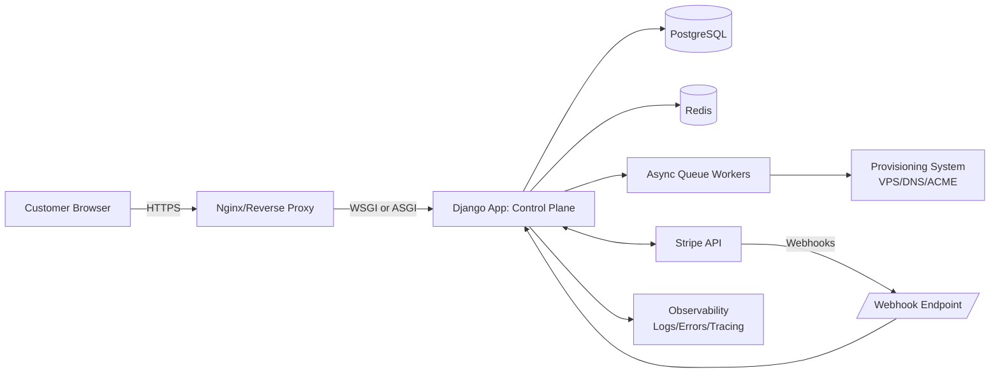
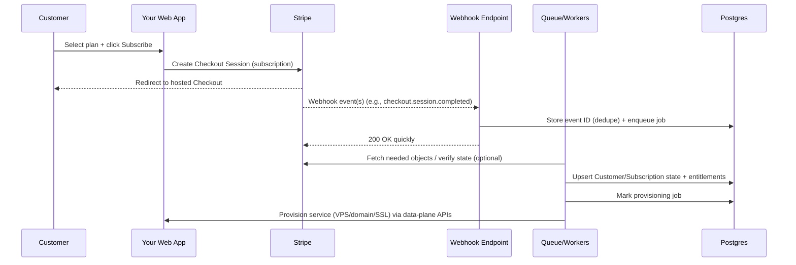
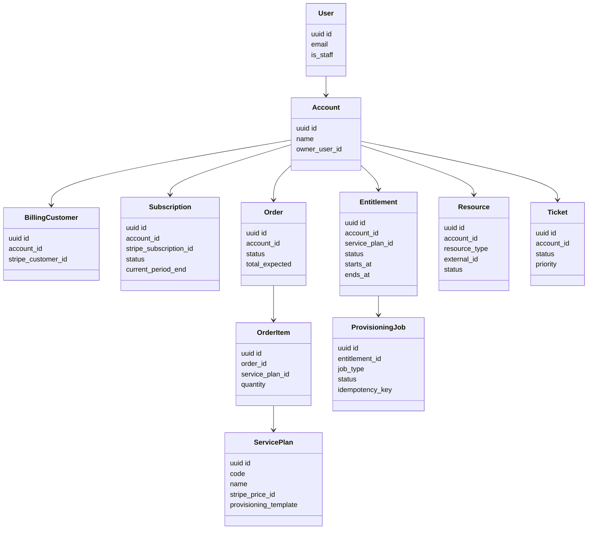
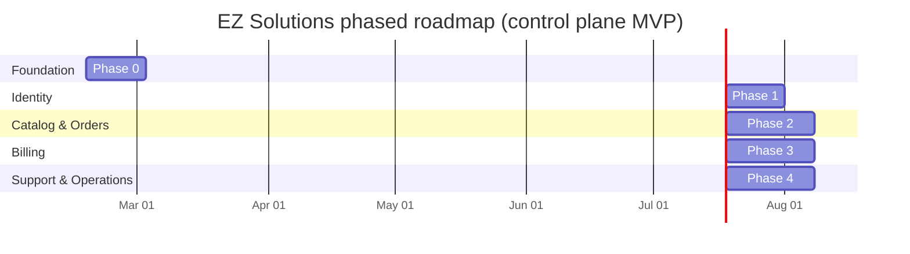

# Production-Grade Standards and Blueprint for a Django-Based SaaS Like EZ Solutions

## Executive summary

Your repository appears to be a **UI-first scaffold** (templates + routing) with **empty apps/models** and **no functional authentication, billing, or provisioning engine**. That staging is common and workable, but the gap from “pretty templates” to “production-grade SaaS” is mostly about (a) designing **reliable state machines** (orders → payments → entitlements → provisioning), (b) implementing **secure-by-default** identity and HTTP hardening, and (c) operationalizing with **testing, observability, and deployment discipline**. citeturn22search0turn22search31turn2view0turn2view2

The most defensible industry-standard approach for your billing scope is to use **Stripe-hosted Checkout + Stripe Customer Portal** and treat **webhooks as the authoritative signal** for subscription state, because subscription billing and payment confirmation are asynchronous by nature. Stripe explicitly recommends webhook signature verification (using the **raw request body**), handling **duplicate deliveries** by tracking processed event IDs, deferring heavy work to an **asynchronous queue**, and returning quickly to avoid timeouts. citeturn2view0turn22search3turn14search4turn2view2turn8search3turn8search11

On security and compliance, the most pragmatic baseline is: follow the official **Django deployment checklist**, run `check --deploy`, and implement the platform security headers/cookie hardening it warns about. Django’s system checks explicitly flag missing HSTS, missing `ALLOWED_HOSTS`, and insecure session cookie settings, and Django’s security docs emphasize sanitizing user input and using built-in protections appropriately. citeturn22search0turn22search12turn22search5turn7search22

Finally, because you’re using AI agents to write code, your biggest leverage is to impose **quality gates** (format/lint/test/CI) and “acceptance-criteria-driven prompting,” so generated code must compile, pass tests, and satisfy security checks before it’s considered done. Tooling like `pre-commit`, Ruff, and pytest-django exist specifically to enforce those gates continuously. citeturn4search2turn4search1turn4search0

## Current-state assumptions and target production goals

### Repository assumptions based on your description

Assuming your agent’s repo assessment is accurate, you currently have:

- A Django project scaffold and templates/routes for marketing pages and auth/dashboard UI.
- `.env.example` present and Stripe keys present (or placeholders) but no backend integration.
- Empty Django app code for `users`, `services`, `orders`, `tickets`, `domains`, `api`, and empty model files. (No migrations, no working ORM schema, no admin registrations.)  
- No installed dependencies / no working virtualenv runtime. (So even dev server likely can’t run reliably yet.)

These assumptions match a common “front-end shell + docs” stage, but they imply **zero trustworthy runtime behavior yet** (no auth, no billing, no data integrity constraints). citeturn22search0turn21search3turn2view2

### Target production properties for EZ Solutions

To be “production-grade” for a hosting/VPS/domain/SSL SaaS, your *minimum* target properties should include:

- **Correctness under retries and duplicates** (especially payments/webhooks and provisioning). Stripe explicitly warns webhooks can be delivered more than once and recommends deduping by event ID. citeturn2view0turn14search4  
- **Defense-in-depth web security** (HTTPS, secure cookies, CSRF/XSS hardening, clickjacking protection, security headers like HSTS/CSP). Django provides built-in mechanisms and explicit deployment checks for many of these. citeturn22search0turn22search12turn21search2turn7search1turn7search2  
- **Traceability and auditability** (billing events, support actions, provisioning actions), with structured logs and error monitoring. Django has built-in logging configuration via `LOGGING`, and production systems typically integrate error monitoring. citeturn10search1turn10search5turn9search4  
- **Operational recoverability** (database backups, webhook replay/reconciliation, rollback strategy). Stripe provides guidance on processing undelivered events and indicates events are available via the API for 30 days; PostgreSQL provides standard backup tooling like `pg_dump`. citeturn14search4turn14search24turn10search4  

## Reference architecture and project structure patterns

### Control plane vs data plane architecture

For a “hosting/VPS/domain/SSL + billing” SaaS, Django is best treated as the **control plane**:

- **Control plane (Django + Postgres):** accounts, subscriptions, plans, orders, entitlements, tickets, domain/SSL inventory, provisioning jobs, audit logs.
- **Data plane (infrastructure):** hypervisors/cloud APIs for VPS, DNS provider/registrar systems for domains, certificate automation (ACME), monitoring, backups.

This separation reduces blast radius: when provisioning systems are slow or failing, your customer dashboard and billing state should still be consistent and observable. Stripe also implies you should queue webhook work asynchronously to avoid overload during event spikes (e.g., subscription renewals), which fits naturally into a control-plane design. citeturn2view0turn5search9



Django explicitly supports both WSGI and ASGI deployment models, with official guidance for each. Your initial control-plane can remain synchronous (WSGI) unless you need WebSockets or high concurrency patterns; you can still run async workers for background jobs. citeturn5search3turn5search4turn5search7

### Adopt an industry-standard SaaS project scaffold and settings separation

**Cookiecutter Django** is widely used in industry as a starting point for production-ready Django, largely because it bakes in conventions for:

- Separate settings modules for local/test/production
- Environment-variable-driven config (`.env` files locally, real env vars in production)
- Docker-first workflows (optional)
- Opinionated integration patterns for Postgres, Redis/Celery, etc.

The general principle aligns with the Twelve-Factor “store config in the environment” guideline: config must be separated from code, and code should be publishable without leaking secrets. citeturn7search0turn2view0turn22search0

Even if you don’t fully re-template your repo, you should copy the *pattern*:

- `config/settings/base.py`
- `config/settings/local.py`
- `config/settings/test.py`
- `config/settings/production.py`
- A single settings loader selected via environment variable (e.g., `DJANGO_SETTINGS_MODULE` is the standard mechanism used by Django tooling). citeturn5search3turn9search2turn7search0

### Database and runtime components

For production, choose **PostgreSQL** as the canonical system-of-record database and run it as a managed service or a hardened cluster. Django officially supports PostgreSQL and documents connection behavior such as persistent connections and cautions around ASGI connection reuse. citeturn6view0turn5search2

For serving requests, Django’s official deployment docs recommend switching away from `runserver` and using a production-ready WSGI/ASGI server; Django provides “How to use Django with Gunicorn” as an official path for WSGI. citeturn22search0turn5search0turn5search3

For asynchronous work (webhooks, provisioning, email, invoice reconciliation), use a task queue. Stripe explicitly recommends processing webhooks asynchronously, and Celery’s Django docs warn about a common pitfall: firing tasks before the database transaction commits. citeturn2view0turn5search9

### Deployment options comparison

| Option | When it fits | Pros | Cons / risks | Primary references |
|---|---|---|---|---|
| WSGI (Gunicorn) behind reverse proxy | Classic server-rendered Django SaaS | Simple, common, officially documented path | Doesn’t give you WebSockets without separate ASGI stack | citeturn5search0turn5search3 |
| ASGI (Uvicorn/Daphne/Hypercorn) behind reverse proxy | You need WebSockets, async views, SSE | Official Django guidance exists; enables async workloads | Must manage async DB connection pooling carefully | citeturn5search4turn6view0 |
| Docker Compose (App + Postgres + Redis) | MVP → early production | Repeatable environments, good for AI-assisted dev | You still need observability, backups, patching | citeturn7search0turn22search0 |
| Kubernetes (optional) | Later scaling / multi-region / platform standardization | Strong orchestration & rollout controls | Complexity overhead; premature for MVP | (Rollout concepts referenced below) citeturn12search1turn12search13 |

## Identity, authentication, and admin patterns

### Built-in auth vs django-allauth

Django ships with a built-in authentication system covering users, groups, permissions, and cookie-based sessions, plus reusable login/logout/password views (you provide templates). citeturn21search3turn21search0

Use **Django built-in auth** when:

- You want the simplest implementation with fewer moving parts.
- You don’t need social login, email verification flows, or built-in MFA features immediately.

Use **django-allauth** when:

- You want higher-level account management: email verification policies and modern MFA (TOTP + recovery codes), and possibly social login later.
- You want standardized flows rather than rolling your own (which is risky with AI-generated code). allauth documents configuration for email verification and has an MFA module with TOTP and recovery codes documented. citeturn3search19turn3search2

**Recommendation for your profile (IT generalist, AI-assisted coding):** prefer django-allauth for account workflows because it reduces the amount of security-sensitive code you must author and maintain. MFA is a major risk reducer for admin/staff accounts (and later for customers). citeturn3search2turn22search27

### Session vs JWT for web vs API

You likely have two surfaces:

- A server-rendered web dashboard (your Bootstrap templates).
- An API surface (your planned `api` app).

For browser-based web apps, Django’s **session authentication** is the natural default because it works with Django’s middleware and CSRF protections. Django’s session framework stores session data server-side and uses a cookie containing a session ID (not the session data itself). citeturn21search1turn21search3

If you build a browser-facing API consumed by AJAX from the same domain, Django REST Framework notes that with `SessionAuthentication` you must include a valid CSRF token for unsafe methods. citeturn3search3turn3search0

JWT becomes appealing when:

- You have third-party clients (mobile apps, external integrations).
- You need stateless auth across many services.

But JWT moves risk to token storage and revocation logic; for an MVP with your current UI stack, **sessions for web** and (optionally later) a separate token strategy for external APIs is safer and simpler. The OWASP REST guidance emphasizes HTTPS-only endpoints to protect credentials (including tokens) in transit. citeturn21search1turn3search3turn1search24

### Django admin as an internal operations console

Django’s admin site can rapidly become your internal “ops UI” for managing services, orders, tickets, and provisioning queues. Django’s admin is extensively configurable and commonly used for operational workflows. citeturn3search1turn3search5

Production hardening recommendations for admin:

- Enforce least privilege using groups/permissions (Django provides this). citeturn21search3turn21search0  
- Put admin behind HTTPS (always) and consider access restrictions (e.g., staff-only + MFA). allauth MFA provides TOTP flows. citeturn3search2turn1search24  
- Enable clickjacking protection with `XFrameOptionsMiddleware` and appropriate `X_FRAME_OPTIONS`. Django documents this middleware and defaults. citeturn21search2turn22search12  

### Auth options comparison table

| Choice | Fit | Security posture considerations | Implementation cost | Primary references |
|---|---|---|---|---|
| Django built-in auth views + sessions | Best for server-rendered dashboard MVP | Strong defaults; relies on CSRF middleware | Low | citeturn21search0turn3search0turn22search12 |
| django-allauth + sessions | Best for SaaS accounts (email verification, MFA) | MFA support; configurable email verification methods | Medium | citeturn3search19turn3search2 |
| DRF SessionAuthentication | Browser SPA on same origin | Must include CSRF token for unsafe methods | Medium | citeturn3search3turn3search0 |
| DRF JWT (later) | External clients/integrations | Token lifecycle, rotation, revocation becomes your responsibility | Medium–High | (HTTPS requirement baseline) citeturn1search24 |

## Subscription billing and Stripe integration patterns

### Billing flow recommendation: Checkout + webhooks + Customer Portal

Stripe’s “Build subscriptions with Checkout” guide describes a path where you model your product catalog, create a Checkout session, monitor subscription events, provision access, and optionally set up a hosted customer portal. citeturn2view2turn8search3turn8search11

This architecture matches SaaS norms because:

- Checkout minimizes payment-UI complexity and reduces the risk of handling card data in your environment. Stripe describes Checkout as a prebuilt payment page that Stripe hosts and that uses the Checkout Sessions API. citeturn8search37turn8search2  
- Subscriptions require asynchronous state handling: Stripe’s subscription webhook guidance emphasizes using webhooks to manage subscription activity because much happens asynchronously. citeturn2view1turn14search19  



Stripe’s webhook docs explicitly advise (a) deferring complex logic and returning success quickly, (b) handling duplicate events by logging processed event IDs, and (c) using an asynchronous queue to avoid scale issues. citeturn2view0turn14search4

### Webhooks: signature verification, raw body, CSRF exemption, retries

Stripe’s webhook docs provide several non-negotiables:

- **Verify signatures** and ensure the request comes from Stripe. citeturn2view0turn22search7  
- Verification requires the **raw request body**; body manipulation causes verification failure. citeturn22search3turn2view0  
- Webhook endpoints can receive the **same event more than once**; dedupe by event IDs. citeturn2view0  
- Stripe notes that many frameworks enforce CSRF tokens on POST; they recommend **exempting webhook routes** from CSRF protection to avoid blocking legitimate events. citeturn2view0turn3search0  
- Stripe retries failed webhooks for up to **three days** with exponential backoff and provides guidance for processing undelivered events via the Events API. citeturn14search4turn14search19turn14search24  

### Minimal Django pattern: webhook signature verification + idempotent processing

Below is a minimal pattern that aligns with Stripe’s recommendations (raw body verification, CSRF exemption, event ID dedupe, async processing). citeturn22search3turn2view0turn14search4turn5search9

```python
# views.py (minimal example)
import stripe
from django.conf import settings
from django.db import transaction, IntegrityError
from django.http import HttpResponse
from django.views.decorators.csrf import csrf_exempt

from .models import StripeEvent
from .tasks import process_stripe_event  # Celery task

@csrf_exempt  # Stripe recommends CSRF exemption for webhook endpoints.
def stripe_webhook(request):
    payload = request.body  # MUST be raw body for signature verification.

    sig_header = request.META.get("HTTP_STRIPE_SIGNATURE", "")
    try:
        event = stripe.Webhook.construct_event(
            payload=payload,
            sig_header=sig_header,
            secret=settings.STRIPE_WEBHOOK_SECRET,
        )
    except ValueError:
        # Invalid payload
        return HttpResponse(status=400)
    except stripe.error.SignatureVerificationError:
        # Invalid signature
        return HttpResponse(status=400)

    # Idempotent processing: store Stripe event id with a UNIQUE constraint.
    try:
        with transaction.atomic():
            obj, created = StripeEvent.objects.get_or_create(
                stripe_event_id=event["id"],
                defaults={
                    "event_type": event["type"],
                    "payload": event,  # store minimally if desired
                },
            )
            if not created and obj.processed_at is not None:
                return HttpResponse(status=200)  # already processed

            # Queue heavy work and return quickly (Stripe recommends async handling).
            process_stripe_event.delay(event["id"])
    except IntegrityError:
        # Another worker beat us to inserting; treat as duplicate.
        return HttpResponse(status=200)

    return HttpResponse(status=200)
```

Model stub:

```python
# models.py (minimal example)
from django.db import models

class StripeEvent(models.Model):
    stripe_event_id = models.CharField(max_length=255, unique=True)
    event_type = models.CharField(max_length=255)
    payload = models.JSONField()
    received_at = models.DateTimeField(auto_now_add=True)
    processed_at = models.DateTimeField(null=True, blank=True)
    processing_error = models.TextField(null=True, blank=True)
```

Why this matches industry norms:

- Stripe explicitly recommends logging event IDs to guard against duplicates. citeturn2view0  
- Stripe requires raw body verification for signatures. citeturn22search3turn22search7  
- Stripe recommends async queues for scaling. citeturn2view0turn5search9  

### Outbound idempotency keys (important for provisioning + Stripe API calls)

Even if your inbound webhook processing is idempotent, you also want outbound calls to be idempotent whenever a “create” operation might be retried (network errors, timeouts, worker restarts). Stripe Event objects can include a `request.idempotency_key` for events triggered by API requests, which indicates Stripe supports capturing an idempotency key for causative requests; use this as a hint to consistently supply idempotency keys for create actions and to log/request-trace them. citeturn14search9turn14search16

For the rest of your control plane (e.g., creating VPS instances, issuing certificates), apply the same principle recommended in OWASP payment gateway guidance: **process a callback only once** and use unique transaction identifiers to enforce idempotency. citeturn11search7

### PCI scope and why hosted payments matter

Stripe states PCI compliance is shared responsibility and that Stripe is certified as a PCI Level 1 service provider, while you must attest compliance for your business. Stripe also recommends using lower-risk integrations to reduce PCI obligations by keeping payment information from passing through your servers. citeturn1search9turn8search14

PCI SSC’s SAQ A (PCI DSS v4.0) eligibility language indicates SAQ A is for channels where processing is outsourced to a PCI DSS compliant third-party service provider/payment processor and, for e-commerce, where the payment page elements delivered to the customer originate only and directly from such providers. This is the compliance logic that makes Stripe-hosted Checkout attractive for reducing scope (though not eliminating it). citeturn20view2

## Canonical data model blueprint for hosting/VPS/domain/SSL SaaS

### Core principle: mirror external IDs, but keep your own state machine

For a SaaS that sells infra services, you want **your database** to be the authoritative record of:

- What the customer purchased (order line items)
- What they are entitled to (entitlements)
- What is provisioned (resources)
- What is billable now (subscription status snapshot)

Stripe is authoritative for payment artifacts (customers, subscriptions, invoices), but you still need local models for idempotency, audit trails, and service provisioning. Stripe explicitly expects you to “provision or de-provision access” based on subscription webhook events. citeturn2view1turn2view0

### Recommended models (minimum viable)

Below is a pragmatic schema that supports subscription billing + provisioning + support:



Key modeling notes:

- Keep Stripe identifiers (customer/subscription/price IDs) as **string fields** on local models; Stripe’s docs show that events include object IDs and that you can retrieve event details via the API for 30 days. citeturn14search24turn14search3turn14search9  
- Make entitlements explicit: Stripe says entitlements events can be used to provision/de-provision features; even if you don’t use Stripe’s entitlements product, your SaaS still needs the concept. citeturn2view1  
- Provisioning should be modeled as **jobs** with status + idempotency keys, to protect against retries and partial failure (aligned with Stripe’s duplicate-event guidance and OWASP idempotency guidance). citeturn2view0turn11search7  

### Domain registration and SSL automation: standards and implications

If you sell domain registration, you will almost certainly integrate with a registrar/reseller platform that uses (directly or indirectly) the **Extensible Provisioning Protocol (EPP)**, defined in RFC 5730 as an application-layer protocol for provisioning and managing objects in a central repository. This typically informs your model needs: contacts, domain objects, auth codes, transfer status, and renewal cycles. citeturn11search2turn11search26turn11search18

If you sell SSL certificates or automate SSL for customer domains, the dominant automation standard is **ACME** (RFC 8555). Let’s Encrypt documents that it uses ACME to verify control over domain names and issue certificates, and its “How it works” overview describes the objective: automatic browser-trusted certificates without human intervention. citeturn11search0turn11search4turn11search5turn11search13

Practical data implications:

- You need domain ownership verification state (DNS-01/HTTP-01 challenges) and renewal scheduling (ACME is lifecycle management, not a one-time action). citeturn11search4turn11search5  
- Certificates and private keys become **high-sensitivity secrets**, so your secrets management standards must be mature (centralized storage, rotation, least privilege). OWASP’s secrets management guidance emphasizes centralized storage, auditing, rotation, and preventing leaks. citeturn13search2turn7search0  

## Security hardening, compliance, and operational excellence

### Django security baseline you should treat as mandatory

Start with official Django guidance:

- Run `manage.py check --deploy` as part of CI and before every production release; Django’s deployment checklist explicitly calls this out. citeturn22search0turn12search3  
- Do not use `runserver` in production; the Django checklist explicitly says to switch to a production-ready WSGI/ASGI server. citeturn22search0turn5search7  
- Configure `ALLOWED_HOSTS` to prevent Host header attacks. citeturn22search5  
- Enable `SecurityMiddleware` and implement the headers/cookie settings it checks for (HSTS, `SECURE_CONTENT_TYPE_NOSNIFF`, secure session cookies). Django’s system check outputs enumerate these warnings. citeturn22search12turn7search3  

### HTTPS, HSTS, CSP, secure cookies, CSRF, clickjacking

- HSTS: OWASP defines HSTS as a response header that instructs browsers to always use HTTPS for a domain after receiving the policy. Django’s middleware can set HSTS-related headers and Django’s system checks warn when HSTS is missing. citeturn7search2turn22search12turn7search3  
- CSP: OWASP calls CSP a “defense in depth” layer that significantly helps mitigate XSS exploitation, and MDN describes CSP as a browser-enforced restriction system. Use CSP early (at least in report-only mode first) because retrofitting later is hard. citeturn7search1turn7search17  
- Secure cookies: Django’s `check --deploy` warnings explicitly call out missing `SESSION_COOKIE_SECURE` and `SESSION_COOKIE_HTTPONLY`, and Django documents secure CSRF cookie settings like `CSRF_COOKIE_SECURE`. citeturn22search12turn1search7  
- CSRF: Django’s CSRF middleware is enabled by default and is the primary protection mechanism; OWASP’s CSRF cheat sheet explains what CSRF is and why protection matters. citeturn3search0turn1search4  
- Clickjacking: Django documents `XFrameOptionsMiddleware` for setting `X-Frame-Options` headers and explains default behavior/values. citeturn21search2turn7search6  

### Input validation and XSS/SQL injection posture

Django’s security overview states the golden rule: never trust user-controlled data; sanitize and validate inputs (commonly through Django forms/validators) before using them. citeturn7search22turn22search31

CSP and correct template escaping mitigate XSS in the browser context, but you must still validate all inbound data and avoid unsafe HTML injection patterns. OWASP positions CSP as a defense-in-depth layer against XSS specifically. citeturn7search1

### Secrets management and environment configuration

Use the Twelve-Factor config principle: store configuration in the environment; config must be separated from code and code must be open-source-able without leaking credentials. citeturn7search0

Use OWASP secrets management baseline controls: centralized secret storage, auditing/monitoring, rotation, and least privilege, because secrets sprawl is a dominant real-world failure mode. citeturn13search2

### Password security and MFA

Django documents password hashing configuration via `PASSWORD_HASHERS` and explains that Django uses the first hasher for storing passwords. Django also includes built-in password validators and common recommended validators. citeturn13search0turn13search3

From an industry best-practice lens, prioritize MFA and reauthentication for sensitive actions; OWASP’s authentication guidance emphasizes reauthentication after risk events, and allauth provides MFA mechanisms. citeturn22search27turn3search2

### Rate limiting and abuse controls

You have two high-risk surfaces in a hosting SaaS:

- **Authentication endpoints** (login, reset, signup)
- **Provisioning APIs** (create VPS, issue certs, register domain)

Django REST Framework provides throttle primitives for controlling request rates. citeturn13search1  
OWASP’s REST security guidance emphasizes HTTPS-only endpoints; OWASP’s general guidance also repeatedly frames abuse controls (rate limiting, strong auth) as core web security practice. citeturn1search24turn7search6turn22search27

### GDPR privacy principles and operational requirements

If you serve EU users (or operate in the EU), GDPR sets core principles:

- Data minimization, purpose limitation, storage limitation, integrity/confidentiality, and accountability are explicitly defined in Article 5. citeturn18view0  
- Article 32 requires “appropriate technical and organisational measures,” including confidentiality/integrity/availability/resilience, restore capability, and regular testing of controls. citeturn17view1  
- Article 33 imposes breach notification to supervisory authorities “not later than 72 hours” where feasible (with conditions), and also requires documentation of breaches. citeturn17view2  
- Article 17 defines the right to erasure (“right to be forgotten”), creating product requirements around deletion workflows and retention policies. citeturn17view3  

These map directly into your technical roadmap: data retention features, deletion/export workflows, encryption and backup/restore capability, and incident response playbooks.

### Observability and incident response

- Django uses Python logging and supports configuration via `LOGGING` (dictConfig format). citeturn10search1turn10search5turn10search17  
- Error monitoring integrations (e.g., Sentry) provide automatic error reporting and tracing for Django apps; Sentry documents a Django integration. citeturn9search4turn9search8  
- OpenTelemetry documents Django auto-instrumentation, showing how to instrument a Django app and run it with the OpenTelemetry wrapper. citeturn9search2turn9search19  
- NIST provides incident response lifecycle guidance and stresses planning, detection/analysis, containment/recovery, and post-incident activity; NIST’s incident handling guide is a commonly cited operational baseline. citeturn9search3turn9search31  

### Testing, CI, and quality gates for AI-assisted implementation

To safely use AI-generated code, enforce mechanical quality gates:

- `pre-commit` manages hooks and runs checks automatically before commits. citeturn4search2  
- Ruff provides linting and formatting integration and documents ordering of lint/format hooks. citeturn4search1turn4search7  
- pytest-django provides transactional DB fixtures and `django_db` markers; it documents DB isolation semantics that are critical for reliable tests. citeturn4search0turn4search3  
- Django provides its own testing framework docs, but pytest-django is a common industry preference when you want concise tests. citeturn4search9turn4search0  

### Recommended environment variables

This list is intentionally explicit so you can tighten your `.env.example` and align prompts/codegen to it. It also follows the Twelve-Factor principle of separating config from code. citeturn7search0

| Env var | Required | Purpose | Reference anchor |
|---|---:|---|---|
| `DJANGO_SETTINGS_MODULE` | Yes | Selects local/test/prod settings module (standard Django mechanism) | citeturn5search3turn9search2 |
| `DJANGO_SECRET_KEY` | Yes | Secret key for signing cookies/crypto; must not be in repo | (Config-in-env principle) citeturn7search0turn22search0 |
| `DJANGO_DEBUG` | Yes | Must be `False` in production; deployment checklist flags DEBUG | citeturn22search0 |
| `DJANGO_ALLOWED_HOSTS` | Yes | Host header protection | citeturn22search5 |
| `DATABASE_URL` (or `DB_*`) | Yes | Postgres connection config | citeturn6view0turn5search23 |
| `REDIS_URL` | Strongly recommended | Cache + broker for async work | (Async webhook guidance) citeturn2view0turn5search9 |
| `CELERY_BROKER_URL` | Strongly recommended | Broker URL for task queue | citeturn5search9turn2view0 |
| `CELERY_RESULT_BACKEND` | Optional | Task result backend (if used) | citeturn5search30turn5search9 |
| `STRIPE_SECRET_KEY` | Yes | Server-side Stripe API key | citeturn2view0turn14search22 |
| `STRIPE_PUBLISHABLE_KEY` | Yes (web) | Client-side Stripe key (used in frontend) | citeturn2view2turn8search37 |
| `STRIPE_WEBHOOK_SECRET` | Yes | Webhook signing secret (`whsec_...`) | citeturn22search7turn14search30 |
| `STRIPE_PRICE_ID_*` | Recommended | Map plans → Stripe Price IDs (avoid hardcoding) | (Checkout subscription modeling) citeturn2view2 |
| `SENTRY_DSN` | Optional but recommended | Error reporting DSN | citeturn10search2turn9search8 |
| `SENTRY_ENVIRONMENT` | Optional | Prod/staging labeling | citeturn10search2turn10search6 |
| `OTEL_SERVICE_NAME` / OTel exporter vars | Optional | OpenTelemetry tracing identity/export | citeturn9search2turn9search19 |
| `EMAIL_*` (provider-specific) | Recommended | Transactional email (verification, receipts, tickets) | (Auth views rely on email flows; notifications) citeturn21search0turn2view1 |

### Required third-party services for a production-grade MVP

This is the pragmatic “minimum external surface” for your scope:

- Payments/subscriptions: Stripe (Checkout + webhooks + customer portal). citeturn2view2turn2view0turn8search3  
- Transactional email provider (for verification, password reset, ticket updates). Django auth docs explicitly include password management flows and views that often require email integration. citeturn21search0turn2view1  
- Domain/SSL automation capability:
  - ACME certificate authority/client ecosystem (Let’s Encrypt + ACME client). citeturn11search0turn11search4turn11search5  
  - Registrar/reseller integration likely EPP-based. citeturn11search2turn11search18  
- Observability: error monitoring (Sentry), metrics (Prometheus exporters), and/or tracing (OpenTelemetry). citeturn9search4turn9search1turn9search2  
- Database: PostgreSQL and a backup mechanism (`pg_dump`/managed snapshots). citeturn6view0turn10search4  

### Phased MVP roadmap with acceptance criteria and prioritized checklist (PHASE 0–4)

This roadmap is intentionally designed so each phase yields a deployable, testable increment and fits Stripe’s webhook-driven reality. citeturn2view0turn22search0turn4search0



| Phase | Priority deliverables | Acceptance criteria (definition of done) | Primary references |
|---|---|---|---|
| PHASE 0 | Dependencies installed; Postgres wired; initial models+migrations; `check --deploy` wired into CI; logging baseline | App boots in dev/prod settings; DB migrations run clean; `manage.py check --deploy` runs in CI and is reviewed; basic logging configured | citeturn22search0turn10search5turn6view0 |
| PHASE 1 | Sessions-based authentication working; email verification policy decided; staff/admin roles; MFA for staff (if using allauth); CSRF/cookies hardened | Users can register/login/logout; password reset works; staff admin access enforced; CSRF middleware enabled; session cookies secure; key security warnings addressed | citeturn21search0turn3search19turn3search2turn22search12turn3search0 |
| PHASE 2 | Service catalog + plans; order and entitlement state machine; provisioning jobs queue; admin workflows | Can create plans in admin; placing an order creates entitlements/jobs; jobs are idempotent and retry-safe; Celery tasks triggered after commit | citeturn5search9turn12search0turn11search7 |
| PHASE 3 | Stripe Checkout subscriptions; webhook endpoint (signature verification, dedupe, async); customer portal link; reconciliation tooling | Test mode works end-to-end using Stripe CLI listen/trigger; duplicate webhook deliveries do not double-provision; retries are safe; portal session redirects back correctly | citeturn2view2turn2view0turn14search30turn14search1turn8search11turn14search4 |
| PHASE 4 | Ticketing MVP; operational dashboards/alerts; incident response playbook; data retention/deletion workflows | Tickets created/updated with audit log; error monitoring alerts; metrics exported; documented incident process; GDPR deletion/export requests can be executed | citeturn9search4turn9search1turn9search3turn17view3turn18view0 |

### Prompting guidance for AI agents implementing this roadmap

The highest-leverage “prompt improvements” for AI-assisted coding are to convert each phase into **mechanically verifiable constraints**:

- Every feature must include:
  - migrations + admin registration (where applicable)
  - tests (unit + integration) and a reproducible Stripe CLI test path for billing
  - `check --deploy` clean (or documented, justified silences) citeturn22search0turn12search3turn14search30  
- Every webhook handler must:
  - verify signature using raw body
  - dedupe by event ID
  - persist event payload and processing result
  - enqueue heavy work asynchronously citeturn22search3turn2view0turn14search4  
- Every provisioning action must be idempotent (job idempotency key + unique constraints), aligning with OWASP guidance to only fulfill an order once regardless of callback duplicates. citeturn11search7turn2view0  

This is the difference between “AI writes code” and “AI delivers maintainable production behavior”: you’re not asking the agent to be clever; you’re asking it to satisfy objective gates grounded in platform standards. citeturn4search2turn4search0turn22search0